# 202030121 이승엽

## 9월 17일 (4주차)
### git checkout VS switch 차이  
* checkout은 브랜치를 이동하고 파일도 변경 가능. 이 때문에 실수할 위험성이 있음  

* switch 브랜치만 이동할 수 있기 때문에 안전하게 사용할 수 있음  
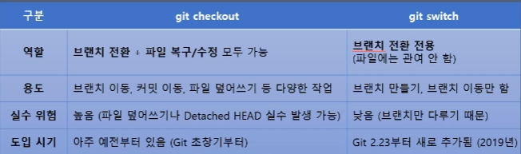  
* 특별한 이유가 없다면 switch 사용  
* checkout이 그대로 남아있는 이유  
    - 파일 복원 등 이미 커밋된 파일을 조작할 수 있기 때문  
    - 특히 git checkout 커밋 해시 명령으로 특정 커밋으로 이동 가능  

### Creating a page  
* Next.js는 파일 시스템 기반 라우팅을 사용하기 때문에 폴더와 파일을 사용하여 경로를 정의  

* page는 특정 경로에서 렌더링되는 UI  

### Creating a layout  
* layout은 여러 페이지에서 공유되는 UI  
    - 네비게이션에서 state 및 상호작용 유지, 다시 렌더링 되지는 않음  

* layout 파일에서 React 컴포넌트의 default export를 사용하여 layout을 정의할 수 있음  
* layout 컴포넌트는 page 또는 다른 layout이 될 수 있는 children prop을 허용해야 함  
```javascript
<Layout>
    <Page />
</Layout>  

<Layout>
    <AnotherLayout>
        <Page/>
    </AnotherLayout>
</Layout> 
```  

* 예를 들어, index 페이지를 자식으로 허용하는 레이아웃을 만들려면 app 디렉토리에 layout 파일을 추가  
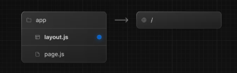  
```javascript
export default function DashboardLayout({
  children,
}: {
  children: React.ReactNode
}) {
  return (
    <html lang="en">
      <body>
        {/* Layout UI */}
        {/* Place children where you want to render a page or nested layout */}
        <main>{children}</main>
      </body>
    </html>
  )
}
```  

### Creating a nested route  
* 중첩 라우트는 다음 URL 세그먼트로 구성된 라우트  
    - 예를 들어, /blog/slug 경로는 세 개의 세그먼트로 구성  
        - / (Root Segment)  
        - blog (Segment)  
        - [slug] (leaf Segemnt)  

* Next.js에서  
    - 폴더는 URL 세그먼트에 매핑되는 경로 세그먼트를 정의하는데 사용  
    - 파일은 세그먼트에 표시되는 UI를 만드는데 사용  
    - 폴더를 중첩하면 중첩된 라우트를 만들 수 있음  
    - 폴더 이름을 대괄호로 묶으면 데이터에서 여러 페이지를 생성하는데 사용되는 동적 경로 세그먼트가 생성  
    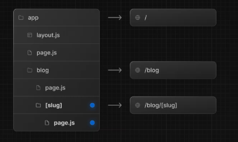
```javascript
// Dummy imports
import { getPosts } from '@/lib/posts'
import { Post } from '@/ui/post'
 
export default async function Page() {
  const posts = await getPosts()
 
  return (
    <ul>
      {posts.map((post) => (
        <Post key={post.id} post={post} />
      ))}
    </ul>
  )
}
```  

* slug는 사이트의 특정 페이지를 쉽게 읽을 수 있는 형태로 식별하는 URL의 일부  
    - [slug]는 반드시 slug일 필요는 없음. 단, [foo]라고 했다면 데이터에 반드시 foo key(필드)가 있어야함  

### Nesting layouts  
* 기본적으로 폴더 계층 구조의 레이아웃도 중첩되어 있음  
    - 즉, 자식 prop을 통해 자식 레이아웃을 감싸게됨  
    - 특정 경로 세그먼트 안에 레이아웃을 추가하여 레이아웃을 중첩할 수 있음  
    - 예를 들어 /blog 경로에 대한 레이아웃을 만들려면 blog 폴더 안에 새 레이아웃 파일을 추가  
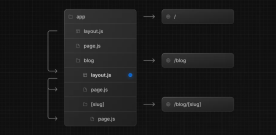
```javascript
export default function BlogLayout({
  children,
}: {
  children: React.ReactNode
}) {
  return <section>{children}</section>
}
```

### Creating a dynamic segement  
* 동적 세그먼트를 사용하면 데이터에서 생성된 경로를 만들 수 있음  
    - 예를 들어, 각 blog 게시물에 대한 경로를 직접 만드는 대신, 동적 세그먼트를 만들어 블로그 게시물 데이터 기반으로 경로를 생성할 수 있음  
    - 동적 세그먼트를 생성하려면 세그먼트 이름을 대괄호로 묶어야함  
```javascript
export default async function BlogPostPage({
  params,
}: {
  params: Promise<{ slug: string }>
}) {
  const { slug } = await params
  const post = await getPost(slug)
 
  return (
    <div>
      <h1>{post.title}</h1>
      <p>{post.content}</p>
    </div>
  )
}
```  

### Rendering with search params  
* 서버 컴포넌트 page에서는 searchParams prop을 사용하여 검색 매개변수에 액세스 할 수 있음  
```javascript
export default async function Page({
  searchParams,
}: {
  searchParams: Promise<{ [key: string]: string | string[] | undefined }>
}) {
  const filters = (await searchParams).filters
}
```  
* searchParams를 사용하면 해당 페이지는 동적 렌더링으로 처리  
    - 왜냐하면 URL의 쿼리 파라미터를 읽기 위해 요청이 필요하기 때문  
    - 클라이언트 컴포넌트는 useSearchParams Hook을 사용하여 검색 매개변수를 읽을 수 있음  


## 9월 10일 (3주차)  
### Folder and file conventions (폴더 및 파일 규칙)  
* 최상위 폴더는 애플리케이션의 코드와 정적 자산을 구성하는 데 사용  
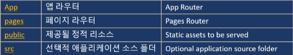  
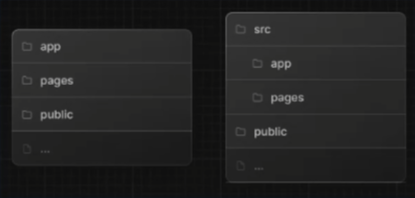  

* 최상위 파일 (Top-level files)  
    - 최상위 파일은 애플리케이션 구성, 종속성 관리, 미들웨어 실행, 모니터링 도구 통합, 환경 변수 정의에 사용  
    - *다음 파일이 프로젝트 생성과 동시에 모두 생성되는건 아님  
    - 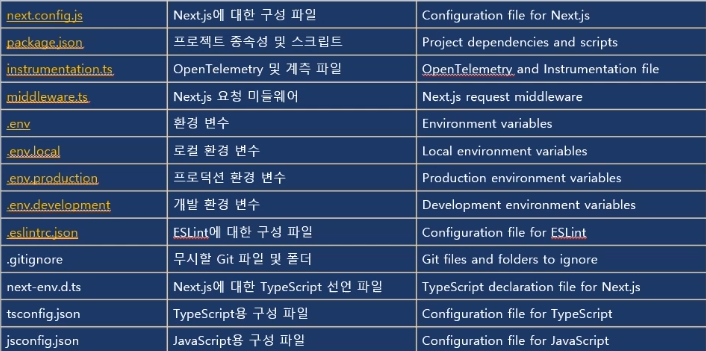  

* 라우팅 파일 (Routing Files)  
    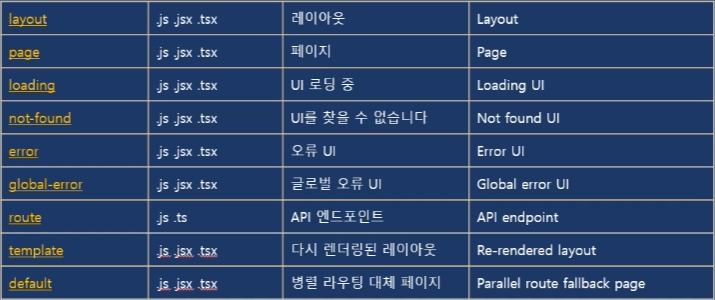  
    - 중첩 라우팅 (Nested routes)  
    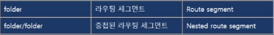  
    - 동적 라우팅 (Dynamic routes)
      
    - 라우팅 그룹 및 비공개 폴더 (Route Groups private folders)  
    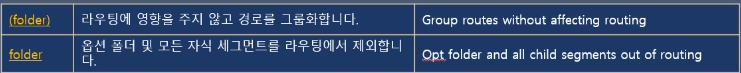  
    - 병렬 및 차단 라우팅 (Parellel and Intercepted Routes)  
      

* 메타데이터 파일 규칙 (Metadata file conventions)  
    - 앱 아이콘 (app icons)  
    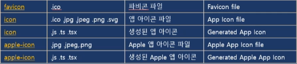  

### Open Graph Protocol  
* 웹사이트나 페이스북, 인스타그램, 카카오톡 등에 링크를 전달할 때 '미리보기'를 생성하는 프로토콜  
    - Open Graph Protocol 이 대표적인 프로토콜  
    - 페이스북이 주도하는 표준화 규칙으로 대부분의 SNS 플랫폼에서 활용  
    - 모든 플랫폼이 동일한 방식으로 오픈 그래프를 처리하는건 아님  
    - 웹페이지의 메타 태그에 선언  
    - ```javascript
        <head>
        <meta property="og:type" content="website">
        <meta property="og:url" content="https://example.com/page.html">
        <meta property="og:title" content="페이지 제목">
        <meta property="og:description" content="페이지 설명 요약">
        <meta property="og:image" content="https://example.com/image.jpg">
        <meta property="og:site_name" content="사이트 이름">
        <meta property="og:locale" content="ko_KR">
        </head>
        ```  

### Organizing your project (프로젝트 구성하기)  
* Next.js는 프로젝트 파일을 어떻게 구성하고 어디에 배치할지에 대한 제약이 없음  
    - 하지만 프로젝트 구성에 도움이 되는 몇 가지 기능을 제공  

* component의 계층 구조 Component hierarchy  
    - 특수 파일에 정의된 컴포넌트는 특정 계층 구조로 렌더링  
    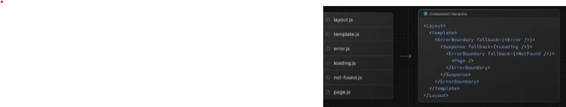  

* layout과 template의 차이  
    - 마스터 텍스트 스타일 편집  
    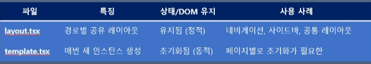  

* component는 중첩된 라우팅에서 재귀적으로 렌더링  
    - 즉, 라우팅 세그먼트의 component는 부모 세그먼트의 component 내부에 중첩   
    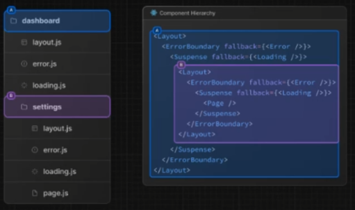  

* 코로케이션 (Colocation) - 파일 및 폴더를 기능별로 그룹화하여 프로젝트의 구조를 명확하게 정의  
    - app 디렉토리에서 중첩된 폴더는 라우팅 구조를 정의  
    - 각 폴더는 URL 경로의 해당 세그먼트에 맵핑되는 라우팅 세그먼트를 나타냄  
    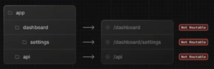  
    - 즉, 프로젝트 파일을 app 디렉토리의 라우팅 세그먼트 내에 안전하게 배치하여 실수로 라우팅 되지 않도록 할 수 있음  
    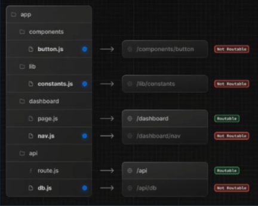  

* 비공개 폴더 (Private folders)  
    - 비공개 폴더는 폴더 앞에 밑줄을 붙여서 만들 수 있음. _folderName  
    - 해당 폴더가 비공개로 구현되는 세부 사항이기 때문에 라우팅 시스템에서 고려되어서는 안 되며, 따라서 해당 폴더와 모든 하위 폴더가 라우팅에서 제외됨  
      

* app 디렉토리의 파일은 기본적으로 안전하게 코로케이션 될 수 있으므로, 코로케이션에 비공개 폴더는 불필요. 하지만 다음과 같은 경우에는 유용할 수 있음  
    - UI 로직과 라우팅 로직을 분리  
    - 프로젝트와 Next.js 생태계 전반에서 내부 파일을 일관되게 구성  
    - 코드 편집기에서 파일을 정렬하고 그룹화  
    - 향후 Next.js 파일 규칙과 관련된 잠재적인 이름 충돌 방지  

* 라우팅 그룹 (Route grops)  
    - 폴더를 괄호로 묶어 라우팅 그룹을 만들 수 있음 (folderName)  
    - 해당 폴더가 구성 목적으로 사용되는 것을 의미하며, 라우터의 URL 경로에 포함되지 않아야 함  
    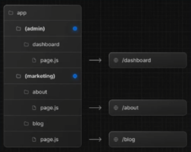  

* 라우팅 그룹은 다음과 같은 경우에 유용  
    - 사이트 섹션, 목적 또는 팀별로 라우트를 구성  
        - 예: 마케팅 페이지, 관리 페이지 등  
    - 동일한 라우팅 세그먼트 수준에서 중첩 레이아웃 활성화  
        - 공통 세그먼트 안에 여러 개의 루트 레이아웃을 포함하여 여러 개의 중첩 레이아웃 만들기  
        - 공통 세그먼트의 라우팅 하위 그룹에 레이아웃 추가  
    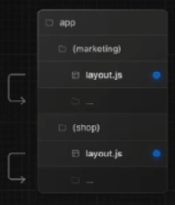  
    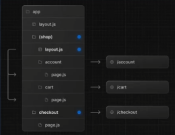  

* src 디렉토리  
    - Next.js는 애플리케이션 코드를 옵션으로 선택하는 src폴더 내에 저장할 수 있도록 지원  
    - 애플리케이션 코드와 주로 프로젝트 루트에 위치하는 프로젝트 설정 파일을 분리할 수 있음  

### Organize routes without affecting the URL path  
* URL 경로에 영향을 주지 않고 라우트를 구성  
    - markting 및 shop 내부의 라우트가 동일한 URL 계층 구조를 공유하더라도, 폴더 안에 layout.js 파일을 추가하여 각 그룹에 대해 다른 레이아웃을 만들 수 있음  
    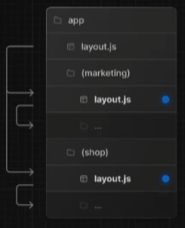  

### Opthing specific segments into a layout  
* 레이아웃에 특정 세그먼트 선택  
    - 특정 라우트를 레이아웃에 포함하려면 새 라우팅 그룹을 만들고, 동일한 레이아웃을 공유하는 라우팅 폴더들을 이 그룹으로 이동  
    - 그룹 외부 라우팅 폴더이는 레이아웃을 공유하지 않음  
    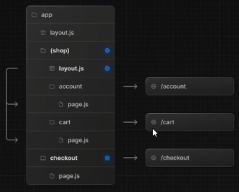  

### Opting for loading skeletons on a specific route  
* 특정 라우트에 스켈레톤 로딩을 적재하도록 선택  
    - loading.js 파일을 통해 특정 라우트 폴더에 로딩 스켈레톤을 적용하려면, 새 라우팅 그룹을 만든 다음 해당 라우팅 그룹 내부로 loading.tsx를 이동  
    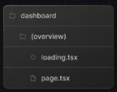  


## 9월 3일 (2주차)
### IDE 플러그인  
* Next.js에는 사용자 정의 TypeScript 플러그인과 유형 검사기가 포함  

* VScode와 다른 코드 편집기에서 고급 유형 검사 및 자동 완성에 사용  
* VScode에서 플러그인을 활성화하는 방법은 다음과 같음  
    - 명령 팔레트 열기 (Ctrl+Shift+P)  
    - TypeScript: TypeScript 버전 선택 검색  
    - Use WorkSpace Version 선택  

### ESLint 설정  
* Next.js에는 ESLint가 내장  

* create-next-app 명령을 사용하여 새 프로젝트 생성 시 필요 패키지 자동 설치 및 적절한 설정 구성  
* 기존 프로젝트에 ESLint를 수동으로 추가하려면 packge.json에 next lint 스크립트를 다음과 같이 추가  
```javascript
    {
        "scripts": (
            "lint": "next lint"
        )
    }
```  

### Improt 및 모듈의 절대 경로 별칭 설정  
* Next.js에는 tsconfig.json 및 jsconfig.json 파일의 "paths" 및 "baseUrl" 옵션에 대한 지원을 내장  

* 이 옵션을 사용하면 프로젝트 디렉터리를 절대 경로로 별칭하여 모듈을 더 쉽고 깔끔하게 가져올 수 있음  
```javascript
import { Button } from '../../../componets/button'  
// After  
import { Button } from '@/components/button'
```  
* 별칭으로 import를 구성하려면 tsconfig.json 또는 jsconfig.json 파일의 baseUrl에 구성 옵션 추가  
```javascript
{
    "compilerOptions": {
        "baseUrl" : "src/"
    }
}  
```  
* baseUrl 경로를 구성하는 것 외에도, "paths" 옵션을 사용하여 모듈 경로를 별칭으로 사용 가능  
* "paths의 각 항목은 baseUrl의 경로애 따라 상대적

### Core Web vitals  
* LCP: 뷰포트 내에서 가장 큰 페이지 요소(큰 텍스트 블록, 이미지 또는 비디오)를 표시하는데 걸리는 시간  

* FID: 사용자가 웹페이지와 상호작용을 시도하는 첫 번쨰 순간부터 웹페이지가 응답하는 시간  
* CLS: 방문자에게 콘텐츠가 얼마나 불안정한지 측정한 값 

### 프로젝트 생성  
1. 프로젝트 이름 입력  
    - ``npx create-next-app 이름``  
2. TypeScript, ESLint, Tailwind를 사용할지 선택  
3. src/ 디렉토리 사용할지 선택  
4. App Router 사용할지 선택  
5. import alias를 사용할지 선택  
6. alias 문자 지정. 기본은 @/*  

### exlintrc.json vs eslint.config.mjs  
* JSON은 주석, 변수, 조건문 등을 쓸 수 없기 때문에 복잡한 설정이 어려움  

* mjs는 ESLint가 새롭게 도입한 방식으로, ESM 형식  
* 확장자 .mjs는 "module javaScript"를 의미  
* ESLint v9 이상에서 공식 권장 방식  
* 조건문, 변수, 동적 로딩 등 코드처럼 유연한 설정 가능  
* 다른 설정 파일을 import해서 재사용 가능  
* 프로젝트 규모가 커질수록 유지보수에 유리  
  

### pnpm  
* pnpm은 Performant NPM의 약자로 고성능 Node 패키지 매니저다.  

* npm, yarn과 같은 목적의 패키지 관리자이지만, 디스크 공간 낭비, 복잡한 의존성 관리, 느린 설치 속도 문제 개선을 위해 개발됨  
* 하드 링크 기반의 효율적인 공간 사용  
    - 패키지를 한 번만 설치하여 글로벌 저장소에 저장하고, 각 프로젝트의 node_modules 디렉토리에는 설치된 패키지에 대한 하드링크가 생성  
* 빠른 패키지 설치 속도  
    - 이미 설치된 패키지는 다시 다운로드하지 않고 재사용하므로, 초기 설치뿐만 아니라 종속성 설치 및 업데이트 할 때도 더 빠른 속도를 경험할 수 있음  
* 엄격하고 효율적인 종속성 관리  
* 다른 패키지 매니저의 비효율성 개선  

### pnpm 설치 및 기본 명령어  
* pnpm 글로벌 설치 : $ npm install -g pnpm  
* 많이 사용하는 명령어  
    - Node-module 설치 : $ pnpm install  
    - 새로운 패키지 설치 : $ pnpm add  
    - 종속성을 최신 버전으로 업데이트 : $ pnpm update  
    - 프로젝트에 설치된 모든 패키지를 표시 : $ pnpm list  
    - 패키지 제거 : $ pnpm remove [package]  
