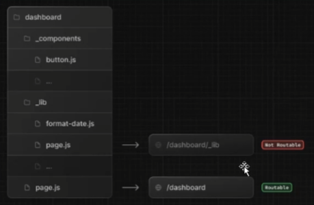

# 202030121 이승엽

## 10월 1일 (6주차)  
### 동적 경로 없는 loading.tsx  
* 동적 경로로 이동할 때 클라이언트는 표시하기 전에 서버의 응답을 기다려야함  
  - 이로 인해 사용자는 앱이 응답하지 않는다는 인상을 받을 수 있음  

* 부분 프래페칭을 활성화하고, 즉시 네비게이션을 트리거하고, 경로가 렌더링되는 동안 로딩 UI를 표시하려면 동적 경로에 loading.tsx를 추가하는 것이 좋음  
```typescript
export default function Loding() {
  return <LoadingSkeleton />
} 
```   

### 동적 세그먼트 없는 generateStaticParams  
* 동적 세그먼트는 사전 렌더링될 수 있지만, generateStaticParams가 누락되어 사전 렌더링되지 않는 경우, 해당 경로는 요청 시점에 동적 렌더링으로 대체  
  - generateStaticParams를 추가하여 빌드 시점에 경로가 정적으로 생성되도록 함  
```typescript
export async function generateStaticParams() {
  const posts = await fetch('https://.../posts').then((res) => res.json())
 
  return posts.map((post) => ({
    slug: post.slug,
  }))
}
 
export default async function Page({
  params,
}: {
  params: Promise<{ slug: string }>
}) {
  const { slug } = await params
  // ...
}
```  

### await이 없어도 async를 붙여 두는 이유  
* Next.js 13+의 App Router에서 page.tsx 같은 Server Component는 비동기 렌더링을 전제로 하고 있음  
  - 즉, page.tsx 안에서 데이터를 fetch하는 경우가 많기 때문에 async를 기본으로 붙여도 전혀 문제가 없슴  
    - 일관성 유지 : 같은 프로젝트 안에서 어떤 페이지는 async, 어떤 페이지는 일반 function이면 혼란스러울 수 있음  
    - 확장성 : 지금은 더미 데이터(posts.find(...))를 쓰지만, 나중에 DB나 API에서 데이터를 가져올 때 await fetch(...) 같은 코드가 들어갈 수 있기 때문에, 미리 async를 붙여 두면 수정할 필요가 없음  
    - React Server Component 호환성 : Server Component는 Promise를 반환할 수 있어야 하고, Next.js는 내부적으로 async 함수 패턴에 맞춰 최적화된 렌더링 파이프라인을 갖고 있어서 async가 붙어 있어도 불필요한 오버헤드가 거의 없음  

### generateStaticParams가 없는 경우와 있는 경우 비교  
* generateStaticParams가 없는 경우 Next.js는 slug 값을 빌드 타임에는 모르는 상태  
  - 따라서 slug 페이지에 접속하면 Next.js가 서버에서 요청할 때마다 해당 페이지를 동적으로 렌더링하며, 빌드의 결과물로 HTML 파일은 생성되지 않음  

* generateStaticParams가 있는 경우 Next.js에 빌드 타임에 생성할 slug 목록을 알려줄 수 있음  
  - 이 경우에는 지정한 slug에 대해서는 정적 HTML + JSON이 빌드 타임에 생성되어, 최초 접근 시 SSR이 필요 없이 미리 만들어진 페이지 제공  
  

### 느린 네트워크  
* 네트워크가 느리거나 불안정한 경우, 사용자가 링크를 클릭하기 전에 프리페칭이 완료되지 않을 수 있음  
  - 이 것은 정적 경로와 동적 경로 모두에 영향을 미칠 수 있음  
  - 이 경우, loading.tsx 파일이 아직 프리페칭되지 않았기 때문에 즉시 표시되지 않을 수 있음  
  - 체감 성능을 개선하기 위해 useLinkStatus Hook을 사용하여 전환이 진행되는 동안 사용자에게 인라인 시각적 피드백을 표시할 수 있음  
```typescript
'use client'

import { useLinkStatus } from 'next/link'

export default function LoadingIndicator() {
  const { pending } = useLinkStatus()
  return pending ? (
    <div role="status" aria-label="Loading" className="spinner" />
  ) : null
}

```  

* 초기 애니메이션 지연을 추가하고, 애니메이션을 보이지 않게 시작하면 로딩 표시기를 디바운스 할 수 있음  
  - 즉, 로딩 표시기는 네비게이션이 지정된 지연 시간보다 오래 걸리는 경우에만 표시  
```typescript
.spinner {
  /* ... */
  opacity: 0;
  animation:
    fadeIn 500ms 100ms forwards,
    rotate 1s linear infinite;
}

@keyframes fadeIn {
  from {
    opacity: 0;
  }
  to {
    opacity: 1;
  }
}

@keyframes rotate {
  to {
    transform: rotate(360deg);
  }
}
```  

### 프리페칭 비활성화  
* Link 컴포넌트에서 프리페치 prop을 false로 설정하여 프리페치를 사용하지 않도록 선택할 수 있음  
  - 이는 대량의 링크목록을 랜더링할 때 불필요한 리소스 사용을 방지하는데 유용함  

* 그러나 프리페칭을 비활성화하면 다음과 같은 단점이 있음  
  - 정적 라우팅은 사용자가 링크를 클릭할 때만 가져옴  
  - 동적 라우팅은 클라이언트가 해당 경로로 이동하기 전에 서버에서 먼저 렌더링 되어야함  
  - 프리페치를 완전히 비활성화하지 않고 리소스 사용량을 줄이려면, 마우스 호버 시에만 프리페치를 사용하면 됨  
    - 이렇게 하면 뷰포트의 모든 링크가 아닌, 사용자가 방문할 가능성이 높은 경로로만 프리페치가 제한  

### Hydration이 완료되지 않음  
* Link는 클라이언트 컴포넌트이기 때문에 라우팅 페이지를 프리페치하기 전에 하이드레이션해야 함  

* 초기 방문 시 대용량 자바스크립트 번들로 인해 하이드레이션이 지연되어 프리페칭이 바로 시작되지 않을 수 있음  

* React는 선택적 Hydration을 통해 이를 완화하며, 다음과 같은 방법으로 이를 더욱 개선할 수 있음  
  - @next/bundle-analyzer 플러그인을 사용하면 대규모 종속성을 제거하며, 번들 크기를 식별하고 줄일 수 있음  
  - 가능하다면 클라이언트에서 서버로 로직을 이동  

### Hydration이란?  
* Hydration이란 서버에서 생성된 HTML에 JavaScript 로직을 추가하여 동적으로 상호작용이 가능하도록 만드는 과정을 의미  
  - 특히, React, Vue 등 프론트엔드 라이브러리나 프레임워크에서 많이 사용되는 용어로, 서버 사이드 렌더링(SSR)으로 생성된 정적인 HTML에 클라이언트 측에서 JavaScript를 통해 이벤트 리스너, 상태 관리 등을 주입하여 인터랙티브한 웹 페이지로 변환하는 과정을 말함  

* SSR과 Hydration  
  - SSR은 서버에서 미리 HTML을 생성하여 사용자에게 전달하는 방식
  - 초기 로딩 속도가 빠르다는 장점이 있지만, 서버에서 생성된 HTML은 정적인 상태이므로 JavaScript 코드를 통해 동적인 상호작용을 구현하려면 추가적인 작업이 필요  

* Hydration의 역할  
  - Hydration은 SSR로 생성된 정적인 HTML에 클라이언트 측 JavaScript를 연결하여, 페이지가 로드된 후에도 사용자와의 상호작용이 가능하도록 만듬  

### Examples – 네이티브 히스토리 API  
* Next.js를 사용하면 기본 window.history.pushState 및 window.history.replaceState 메서드를 사용하여 페이지를 다시 로드하지 않고도 브라우저의 기록 스택을 업데이트할 수 있음  

* pushState 및 replaceState 호출은 Next.js 라우터에 통합되어 usePathname 및 useSearchParams와 동기화할 수 있음  

* window.history.pushState  
  - 이것을 사용하여 브라우저의 기록 스택에 새 항목을 추가할 수 있음  
  - 사용자는 이전 상태로 돌아갈 수 있음  

* window.history.replaceState  
  - 브라우저의 기록 스택에서 현재 항목을 바꾸려면 이 기능을 사용  
  - 사용자는 이전 상태로 돌아갈 수 없음  
```javascript
'use client'

import { usePathname } from 'next/navigation'

export function LocaleSwitcher() {
  const pathname = usePathname()

  function switchLocale(locale: string) {
    // e.g. '/en/about' or '/fr/contact'
    const newPath = `/${locale}${pathname}`
    window.history.replaceState(null, '', newPath)
  }

  return (
    <>
      <button onClick={() => switchLocale('en')}>English</button>
      <button onClick={() => switchLocale('fr')}>French</button>
    </>
  )
}
```


## 9월 24일 (5주차)
### searchParams  
* URL의 쿼리 문자열을 읽는 방법  
  - 예시 url : /products?category=shoes&page=2  
  - 여기서 category=shoes, page=2가 parameters  
  - searchParams는 컴포넌트의 props로 전달되며, 내부적으로는 URLSearchParams처럼 작동  
    

### Linking between pages  
* Link 컴포넌트를 사용하여 경로 사이를 탐색할 수 있음  

* Link 는 HTML <a> 태그를 확장하여 prefetching 및 client-side navigation 기능을 제공하는 Next.js의 기본제공 컴포넌트

### 왜 동적 렌더링이 되는가  
* Next.js에서 페이지는 크게 정적 또는 동적으로 렌더링될 수 있음  

* searchParams는 요청이 들어와야만 값을 알 수 있기 때문에, Next.js는 이 페이지를 정적으로 미리 생성할 수 없고, 요청이 올 때마다 새로 렌더링해야함  
  - 따라서 해당 페이지는 자동으로 동적 렌더링으로 처리됨  
```javascript
import Link from 'next/link'
 
export default async function Post({ post }) {
  const posts = await getPosts()
 
  return (
    <ul>
      {posts.map((post) => (
        <li key={post.slug}>
          <Link href={`/blog/${post.slug}`}>{post.title}</Link>
        </li>
      ))}
    </ul>
  )
}
```

### Route 방식 비교  

* Next.js의 라우팅 방식 : Pages Router VS App Router  


### How navigation works  
* Next.js에서 네비게이션이 어떻게 작동하는지 이해하려면 다음 개념에 익숙해져야함  
  - Server Rendering  
  - Prefetching  
  - Streaming  
  - Client-side transitions  

### Server Rendering  
* Next.js에서 레이아웃과 페이지는 기본적으로 React 서버 컴포넌트  

* 초기 네비게이션 및 후속 네비게이션 할 때, 서버 컴포넌트 페이로드는 클라이언트로 전송되기 전에 서버에서 생성

* 서버 렌더링에는 발생 시점에 따라 두 가지 유형이 있음  
  - 정적 렌더링은 빌드 시점이나 재검증 중에 발생하며, 결과는 캐시됨  
  - 동적 렌더링은 클라이언트 요청에 대한 응답으로 요청 시점에 발생  

* 서버 렌더링의 단점은 클라이언트가 새 경로를 표시하기 전에 서버의 응답을 기다려야함  
  - Next.js는 사용자가 방문할 가능성이 높은 경로를 미리 가져 오고, 클라이언트 측 전환을 수행하여 지연 문제를 해결  

### Prefetching  
* 프리페칭은 사용자가 해당 경로로 이동하기 전에 백그라운드에서 해당 경로를 로드하는 프로세스  

* 사용자가 링크를 클릭하기 전에 다음 경로를 렌더링하는 데 필요한 데이터가 클라이언트 측에 이미 준비되어 있기 때문에 애플리케이션에서 경로 간 이동이 즉각적으로 느껴짐  

* Next.js는 Link 컴포넌트와 연결된 경로를 자동으로 사용자 뷰포트에 미리 가져옴  

* <a> 태그를 사용하면 프리페칭을 하지 않음
```typescript
import Link from 'next/link'
 
export default function Layout({ children }: { children: React.ReactNode }) {
  return (
    <html>
      <body>
        <nav>
          {/* Prefetched when the link is hovered or enters the viewport */}
          <Link href="/blog">Blog</Link>
          {/* No prefetching */}
          <a href="/contact">Contact</a>
        </nav>
        {children}
      </body>
    </html>
  )
}
```
* 미리 가져오는 경로의 양은 정적 경로인지 동적 경로인지에 따라 달라짐  
  - 정적 경로 : 전체 경로가 프리페치됨  
  - 동적 경로 : 프리페치를 건너뛰거나, loading.tsx가 있는 경우 경로가 부분적으로 프리페칭됨  

* Next.js는 동적 라우팅을 건너뛰거나 부분적으로 프리페칭하는 방법으로 사용자가 방문하지 않을 수 있는 경로에 대한 서버의 불필요한 작업을 방지  
  - 그러나 네비게이션 전에 서버 응답을 기다리면 사용자에게 앱이 응답하지 않는다는 인상을 줄 수 있음  
  - 동적 경로에 대한 네비게이션 환경을 개선하려면 스트리밍을 사용할 수 있음  
  

### Streaming
* 스트리밍을 사용하면 서버가 전체 경로가 렌더링될 때까지 기다리지 않고, 동적 경로의 일부가 준비되는 즉시 클라이언트에 전송할 수 있음  
  - 즉, 페이지의 일부가 아직 로드 중이더라도 사용자는 더 빨리 콘텐츠를 볼 수 있음  

* 동적 경로의 경우, 부분적으로 미리 가져올 수 있다는 뜻.
  - 즉, 공유 레이아웃과 로딩 스켈레톤을 미리 요청할 수 있음  
  - loading skeletons : 웹 또는 앱에서 콘텐츠가 로드되는 동안 사용자에게 보여지는 빈 화면의 일종  
    

* Next.js는 백그라운드에서 page.tsx 콘텐츠를 <Suspense> 경계로 자동 래핑  
  - 미리 가져온 대체 UI는 경로가 로드되는 동안 표시되고, 준비가 되면 실제 콘텐츠로 대체됨  

* loading.tsx의 이점 :  
  - 사용자에게 즉각적인 네비게이션과 시각적 피드백 제공  
  - 공유 레이아웃은 상호 작용이 가능하고, 네비게이션은 중단될 수 있음  
  - 개선된 핵심 웹 지표 : TTFB, FCP, TTI  

* 네비게이션 환경을 더욱 개선하기 위해 Next.js는 <Link> 컴포넌트를 사용하여 클라이언트 측 전환을 수행  


## 9월 17일 (4주차)
### git checkout VS switch 차이  
* checkout은 브랜치를 이동하고 파일도 변경 가능. 이 때문에 실수할 위험성이 있음  

* switch 브랜치만 이동할 수 있기 때문에 안전하게 사용할 수 있음  
  
* 특별한 이유가 없다면 switch 사용  
* checkout이 그대로 남아있는 이유  
    - 파일 복원 등 이미 커밋된 파일을 조작할 수 있기 때문  
    - 특히 git checkout 커밋 해시 명령으로 특정 커밋으로 이동 가능  

### Creating a page  
* Next.js는 파일 시스템 기반 라우팅을 사용하기 때문에 폴더와 파일을 사용하여 경로를 정의  

* page는 특정 경로에서 렌더링되는 UI  

### Creating a layout  
* layout은 여러 페이지에서 공유되는 UI  
    - 네비게이션에서 state 및 상호작용 유지, 다시 렌더링 되지는 않음  

* layout 파일에서 React 컴포넌트의 default export를 사용하여 layout을 정의할 수 있음  
* layout 컴포넌트는 page 또는 다른 layout이 될 수 있는 children prop을 허용해야 함  
```javascript
<Layout>
    <Page />
</Layout>  

<Layout>
    <AnotherLayout>
        <Page/>
    </AnotherLayout>
</Layout> 
```  

* 예를 들어, index 페이지를 자식으로 허용하는 레이아웃을 만들려면 app 디렉토리에 layout 파일을 추가  
  
```javascript
export default function DashboardLayout({
  children,
}: {
  children: React.ReactNode
}) {
  return (
    <html lang="en">
      <body>
        {/* Layout UI */}
        {/* Place children where you want to render a page or nested layout */}
        <main>{children}</main>
      </body>
    </html>
  )
}
```  

### Creating a nested route  
* 중첩 라우트는 다음 URL 세그먼트로 구성된 라우트  
    - 예를 들어, /blog/slug 경로는 세 개의 세그먼트로 구성  
        - / (Root Segment)  
        - blog (Segment)  
        - [slug] (leaf Segemnt)  

* Next.js에서  
    - 폴더는 URL 세그먼트에 매핑되는 경로 세그먼트를 정의하는데 사용  
    - 파일은 세그먼트에 표시되는 UI를 만드는데 사용  
    - 폴더를 중첩하면 중첩된 라우트를 만들 수 있음  
    - 폴더 이름을 대괄호로 묶으면 데이터에서 여러 페이지를 생성하는데 사용되는 동적 경로 세그먼트가 생성  
    
```javascript
// Dummy imports
import { getPosts } from '@/lib/posts'
import { Post } from '@/ui/post'
 
export default async function Page() {
  const posts = await getPosts()
 
  return (
    <ul>
      {posts.map((post) => (
        <Post key={post.id} post={post} />
      ))}
    </ul>
  )
}
```  

* slug는 사이트의 특정 페이지를 쉽게 읽을 수 있는 형태로 식별하는 URL의 일부  
    - [slug]는 반드시 slug일 필요는 없음. 단, [foo]라고 했다면 데이터에 반드시 foo key(필드)가 있어야함  

### Nesting layouts  
* 기본적으로 폴더 계층 구조의 레이아웃도 중첩되어 있음  
    - 즉, 자식 prop을 통해 자식 레이아웃을 감싸게됨  
    - 특정 경로 세그먼트 안에 레이아웃을 추가하여 레이아웃을 중첩할 수 있음  
    - 예를 들어 /blog 경로에 대한 레이아웃을 만들려면 blog 폴더 안에 새 레이아웃 파일을 추가  

```javascript
export default function BlogLayout({
  children,
}: {
  children: React.ReactNode
}) {
  return <section>{children}</section>
}
```

### Creating a dynamic segement  
* 동적 세그먼트를 사용하면 데이터에서 생성된 경로를 만들 수 있음  
    - 예를 들어, 각 blog 게시물에 대한 경로를 직접 만드는 대신, 동적 세그먼트를 만들어 블로그 게시물 데이터 기반으로 경로를 생성할 수 있음  
    - 동적 세그먼트를 생성하려면 세그먼트 이름을 대괄호로 묶어야함  
```javascript
export default async function BlogPostPage({
  params,
}: {
  params: Promise<{ slug: string }>
}) {
  const { slug } = await params
  const post = await getPost(slug)
 
  return (
    <div>
      <h1>{post.title}</h1>
      <p>{post.content}</p>
    </div>
  )
}
```  

### Rendering with search params  
* 서버 컴포넌트 page에서는 searchParams prop을 사용하여 검색 매개변수에 액세스 할 수 있음  
```javascript
export default async function Page({
  searchParams,
}: {
  searchParams: Promise<{ [key: string]: string | string[] | undefined }>
}) {
  const filters = (await searchParams).filters
}
```  
* searchParams를 사용하면 해당 페이지는 동적 렌더링으로 처리  
    - 왜냐하면 URL의 쿼리 파라미터를 읽기 위해 요청이 필요하기 때문  
    - 클라이언트 컴포넌트는 useSearchParams Hook을 사용하여 검색 매개변수를 읽을 수 있음  


## 9월 10일 (3주차)  
### Folder and file conventions (폴더 및 파일 규칙)  
* 최상위 폴더는 애플리케이션의 코드와 정적 자산을 구성하는 데 사용  
  
  

* 최상위 파일 (Top-level files)  
    - 최상위 파일은 애플리케이션 구성, 종속성 관리, 미들웨어 실행, 모니터링 도구 통합, 환경 변수 정의에 사용  
    - *다음 파일이 프로젝트 생성과 동시에 모두 생성되는건 아님  
    -   

* 라우팅 파일 (Routing Files)  
      
    - 중첩 라우팅 (Nested routes)  
      
    - 동적 라우팅 (Dynamic routes)
      
    - 라우팅 그룹 및 비공개 폴더 (Route Groups private folders)  
      
    - 병렬 및 차단 라우팅 (Parellel and Intercepted Routes)  
      

* 메타데이터 파일 규칙 (Metadata file conventions)  
    - 앱 아이콘 (app icons)  
      

### Open Graph Protocol  
* 웹사이트나 페이스북, 인스타그램, 카카오톡 등에 링크를 전달할 때 '미리보기'를 생성하는 프로토콜  
    - Open Graph Protocol 이 대표적인 프로토콜  
    - 페이스북이 주도하는 표준화 규칙으로 대부분의 SNS 플랫폼에서 활용  
    - 모든 플랫폼이 동일한 방식으로 오픈 그래프를 처리하는건 아님  
    - 웹페이지의 메타 태그에 선언  
    - ```javascript
        <head>
        <meta property="og:type" content="website">
        <meta property="og:url" content="https://example.com/page.html">
        <meta property="og:title" content="페이지 제목">
        <meta property="og:description" content="페이지 설명 요약">
        <meta property="og:image" content="https://example.com/image.jpg">
        <meta property="og:site_name" content="사이트 이름">
        <meta property="og:locale" content="ko_KR">
        </head>
        ```  

### Organizing your project (프로젝트 구성하기)  
* Next.js는 프로젝트 파일을 어떻게 구성하고 어디에 배치할지에 대한 제약이 없음  
    - 하지만 프로젝트 구성에 도움이 되는 몇 가지 기능을 제공  

* component의 계층 구조 Component hierarchy  
    - 특수 파일에 정의된 컴포넌트는 특정 계층 구조로 렌더링  
      

* layout과 template의 차이  
    - 마스터 텍스트 스타일 편집  
      

* component는 중첩된 라우팅에서 재귀적으로 렌더링  
    - 즉, 라우팅 세그먼트의 component는 부모 세그먼트의 component 내부에 중첩   
      

* 코로케이션 (Colocation) - 파일 및 폴더를 기능별로 그룹화하여 프로젝트의 구조를 명확하게 정의  
    - app 디렉토리에서 중첩된 폴더는 라우팅 구조를 정의  
    - 각 폴더는 URL 경로의 해당 세그먼트에 맵핑되는 라우팅 세그먼트를 나타냄  
      
    - 즉, 프로젝트 파일을 app 디렉토리의 라우팅 세그먼트 내에 안전하게 배치하여 실수로 라우팅 되지 않도록 할 수 있음  
      

* 비공개 폴더 (Private folders)  
    - 비공개 폴더는 폴더 앞에 밑줄을 붙여서 만들 수 있음. _folderName  
    - 해당 폴더가 비공개로 구현되는 세부 사항이기 때문에 라우팅 시스템에서 고려되어서는 안 되며, 따라서 해당 폴더와 모든 하위 폴더가 라우팅에서 제외됨  
      

* app 디렉토리의 파일은 기본적으로 안전하게 코로케이션 될 수 있으므로, 코로케이션에 비공개 폴더는 불필요. 하지만 다음과 같은 경우에는 유용할 수 있음  
    - UI 로직과 라우팅 로직을 분리  
    - 프로젝트와 Next.js 생태계 전반에서 내부 파일을 일관되게 구성  
    - 코드 편집기에서 파일을 정렬하고 그룹화  
    - 향후 Next.js 파일 규칙과 관련된 잠재적인 이름 충돌 방지  

* 라우팅 그룹 (Route grops)  
    - 폴더를 괄호로 묶어 라우팅 그룹을 만들 수 있음 (folderName)  
    - 해당 폴더가 구성 목적으로 사용되는 것을 의미하며, 라우터의 URL 경로에 포함되지 않아야 함  
      

* 라우팅 그룹은 다음과 같은 경우에 유용  
    - 사이트 섹션, 목적 또는 팀별로 라우트를 구성  
        - 예: 마케팅 페이지, 관리 페이지 등  
    - 동일한 라우팅 세그먼트 수준에서 중첩 레이아웃 활성화  
        - 공통 세그먼트 안에 여러 개의 루트 레이아웃을 포함하여 여러 개의 중첩 레이아웃 만들기  
        - 공통 세그먼트의 라우팅 하위 그룹에 레이아웃 추가  
      
      

* src 디렉토리  
    - Next.js는 애플리케이션 코드를 옵션으로 선택하는 src폴더 내에 저장할 수 있도록 지원  
    - 애플리케이션 코드와 주로 프로젝트 루트에 위치하는 프로젝트 설정 파일을 분리할 수 있음  

### Organize routes without affecting the URL path  
* URL 경로에 영향을 주지 않고 라우트를 구성  
    - markting 및 shop 내부의 라우트가 동일한 URL 계층 구조를 공유하더라도, 폴더 안에 layout.js 파일을 추가하여 각 그룹에 대해 다른 레이아웃을 만들 수 있음  
      

### Opthing specific segments into a layout  
* 레이아웃에 특정 세그먼트 선택  
    - 특정 라우트를 레이아웃에 포함하려면 새 라우팅 그룹을 만들고, 동일한 레이아웃을 공유하는 라우팅 폴더들을 이 그룹으로 이동  
    - 그룹 외부 라우팅 폴더이는 레이아웃을 공유하지 않음  
      

### Opting for loading skeletons on a specific route  
* 특정 라우트에 스켈레톤 로딩을 적재하도록 선택  
    - loading.js 파일을 통해 특정 라우트 폴더에 로딩 스켈레톤을 적용하려면, 새 라우팅 그룹을 만든 다음 해당 라우팅 그룹 내부로 loading.tsx를 이동  
      


## 9월 3일 (2주차)
### IDE 플러그인  
* Next.js에는 사용자 정의 TypeScript 플러그인과 유형 검사기가 포함  

* VScode와 다른 코드 편집기에서 고급 유형 검사 및 자동 완성에 사용  
* VScode에서 플러그인을 활성화하는 방법은 다음과 같음  
    - 명령 팔레트 열기 (Ctrl+Shift+P)  
    - TypeScript: TypeScript 버전 선택 검색  
    - Use WorkSpace Version 선택  

### ESLint 설정  
* Next.js에는 ESLint가 내장  

* create-next-app 명령을 사용하여 새 프로젝트 생성 시 필요 패키지 자동 설치 및 적절한 설정 구성  
* 기존 프로젝트에 ESLint를 수동으로 추가하려면 packge.json에 next lint 스크립트를 다음과 같이 추가  
```javascript
    {
        "scripts": (
            "lint": "next lint"
        )
    }
```  

### Improt 및 모듈의 절대 경로 별칭 설정  
* Next.js에는 tsconfig.json 및 jsconfig.json 파일의 "paths" 및 "baseUrl" 옵션에 대한 지원을 내장  

* 이 옵션을 사용하면 프로젝트 디렉터리를 절대 경로로 별칭하여 모듈을 더 쉽고 깔끔하게 가져올 수 있음  
```javascript
import { Button } from '../../../componets/button'  
// After  
import { Button } from '@/components/button'
```  
* 별칭으로 import를 구성하려면 tsconfig.json 또는 jsconfig.json 파일의 baseUrl에 구성 옵션 추가  
```javascript
{
    "compilerOptions": {
        "baseUrl" : "src/"
    }
}  
```  
* baseUrl 경로를 구성하는 것 외에도, "paths" 옵션을 사용하여 모듈 경로를 별칭으로 사용 가능  
* "paths의 각 항목은 baseUrl의 경로애 따라 상대적

### Core Web vitals  
* LCP: 뷰포트 내에서 가장 큰 페이지 요소(큰 텍스트 블록, 이미지 또는 비디오)를 표시하는데 걸리는 시간  

* FID: 사용자가 웹페이지와 상호작용을 시도하는 첫 번쨰 순간부터 웹페이지가 응답하는 시간  
* CLS: 방문자에게 콘텐츠가 얼마나 불안정한지 측정한 값 

### 프로젝트 생성  
1. 프로젝트 이름 입력  
    - ``npx create-next-app 이름``  
2. TypeScript, ESLint, Tailwind를 사용할지 선택  
3. src/ 디렉토리 사용할지 선택  
4. App Router 사용할지 선택  
5. import alias를 사용할지 선택  
6. alias 문자 지정. 기본은 @/*  

### exlintrc.json vs eslint.config.mjs  
* JSON은 주석, 변수, 조건문 등을 쓸 수 없기 때문에 복잡한 설정이 어려움  

* mjs는 ESLint가 새롭게 도입한 방식으로, ESM 형식  
* 확장자 .mjs는 "module javaScript"를 의미  
* ESLint v9 이상에서 공식 권장 방식  
* 조건문, 변수, 동적 로딩 등 코드처럼 유연한 설정 가능  
* 다른 설정 파일을 import해서 재사용 가능  
* 프로젝트 규모가 커질수록 유지보수에 유리  
  

### pnpm  
* pnpm은 Performant NPM의 약자로 고성능 Node 패키지 매니저다.  

* npm, yarn과 같은 목적의 패키지 관리자이지만, 디스크 공간 낭비, 복잡한 의존성 관리, 느린 설치 속도 문제 개선을 위해 개발됨  
* 하드 링크 기반의 효율적인 공간 사용  
    - 패키지를 한 번만 설치하여 글로벌 저장소에 저장하고, 각 프로젝트의 node_modules 디렉토리에는 설치된 패키지에 대한 하드링크가 생성  
* 빠른 패키지 설치 속도  
    - 이미 설치된 패키지는 다시 다운로드하지 않고 재사용하므로, 초기 설치뿐만 아니라 종속성 설치 및 업데이트 할 때도 더 빠른 속도를 경험할 수 있음  
* 엄격하고 효율적인 종속성 관리  
* 다른 패키지 매니저의 비효율성 개선  

### pnpm 설치 및 기본 명령어  
* pnpm 글로벌 설치 : $ npm install -g pnpm  
* 많이 사용하는 명령어  
    - Node-module 설치 : $ pnpm install  
    - 새로운 패키지 설치 : $ pnpm add  
    - 종속성을 최신 버전으로 업데이트 : $ pnpm update  
    - 프로젝트에 설치된 모든 패키지를 표시 : $ pnpm list  
    - 패키지 제거 : $ pnpm remove [package]  
