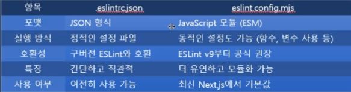

# 202030121 이승엽

## 11월 26일 (13주차)
### 이미지 최적화  
* The Next.js `<Image>` 컴포넌트는 HTML `` 요소를 확장하여 제공  

* 크기 최적화: 각 기기에 맞게 자동으로 적절한 크기의 이미지를 제공  
  -  WebP와 같은 최신 이미지 형식을 사용  

* 시각적 안정성: 이미지 로딩 시 레이아웃 이동(layout shift)을 자동으로 방지  

* 더 빠른 페이로드: 기본 브라우저 지연 로딩(native browser lazy loading)을 사용  
  - 뷰포트에 들어갈 때만 이미지를 로드하며, 선택적 흐리게 표시되는 placeholder를 제공  

* 자산(Asset) 유연성: 원격 서버에 저장된 이미지도 원하는 대로 이미지 크기를 조정  

```tsx
// app/page.tsx
import Image from 'next/image'

export default function Page() {
  return <Image src="..." alt="" />
}
```  

### WebP 특징  
*  WebP는 효율적인 압축으로 파일 크기가 작고, 손실 및 무손실 압축을 지원하며 투명도(알파 채널) 및 애니메이션 기능을 지원  
  - 이러한 특징을 통해 웹 페이지 로딩 속도를 향상  
  - 대역폭 사용량 감소  
  - JPEG, PNG, GIF 등 기존 이미지 형식의 장점을 한 번에 포함  

* WebP의 장점  
  - 파일 크기가 작아 웹사이트 로딩 속도를 개선  
  - 데이터 전송 속도를 높이고 저장 공간을 절약  
  - 기존 이미지 형식의 단점을 보완하여 고품질 이미지를 효율적으로 표현  

### 로컬 이미지
```tsx
// src/app/blog3/page.tsx
import Image from 'next/image'

export default function Page() {
  return (
    <div>
      <Image
        className="dark:invert"
        src="/nextjs.png"
        alt="Picture of the author"
        width={360}
        height={218}
      />
    </div>
  )
}

```  

### import 이미지 vs public 이미지  
* Static Import 방식  
  - 99%의 이미지에서 이 방식을 사용  
  - 로고, 아이콘, 포스트 썸네일, 상품 이미지, 히어로 이미지 등 앱 안에 표시되는 거의 모든 정적 이미지는 무조건 Static Import 방식을 사용  

* public 디렉토리 이용 방식  
  - public 디렉토리 이용 방식은 꼭 필요한 예외적인 경우에만 사용  
  - favicon.ico, robots.txt, manifest.json 등의 정적 파일일 때 사용  
  - OG 이미지, Twitter Card, 메타 이미지가 필요할 때 사용  
  - 사용자가 업로드한 이미지나, CMS에서 런타임에 경로가 결정되는 이미지 처리가 필요할 때 사용  

### 원격 이미지  
* 원격 이미지를 사용할 때 src 속성에 URL 문자열을 지정  
```tsx
// app/page.tsx
import Image from 'next/image'

export default function Page() {
  return (
    <div>
      <Image
        src="https://s3.amazonaws.com/my-bucket/profile.png"
        alt="Picture of the author"
        width={500}
        height={500}
      />
    </div>
  )
}
```  

* Next.js는 빌드 과정에서 원격 파일에 접근할 수 없으므로 width, height 및 선택적 blurDataURL 속성을 수동으로 제공  
  - width와 height는 이미지의 정확한 종횡비를 추론, 이미지 로딩으로 인한 레이아웃 변동(CLS)을 방지하는 데 사용  
  - 또는 fill 속성을 사용하여 이미지가 부모 요소의 크기를 채우도록 할 수도 있음  

*  원격 서버의 이미지를 안전하게 허용하려면, next.config.js에서 허용되는 URL 패턴 목록을 정의  

* 악의적인 사용을 방지하기 위해 가능한 한 구체적으로 지정  
  - 예를 들어, 다음 구성은 특정 AWS S3 버킷의 이미지만 허용  
  ```ts
  // next.config.ts
  import type { NextConfig } from 'next'

  const config: NextConfig = {
    images: {
      remotePatterns: [
        {
          protocol: 'https',
          hostname: 's3.amazonaws.com',
          port: '',
          pathname: '/my-bucket/**',
        },
      ],
    },
  }

  export default config

  // next.config.ts 기본 형태
  import type { NextConfig } from "next";

  const nextConfig: NextConfig = {
    /* config options here */
  };

  export default nextConfig;
  ```  

### 폰트 최적화  
* next/font 모듈은 자동으로 글꼴을 최적화하고, 외부 네트워크 요청을 제거하여 개인정보 보호와 성능을 향상  
  - 이 모듈은 모든 글꼴 파일에 대한 자체 호스팅 기능이 내장되어 있음  
    - 즉, 레이아웃 이동 없이 웹 글꼴을 최적의 상태로 로드  
  - next/font 사용을 시작하려면, 먼저 next/font/local 또는 next/font/google에서 import하고, 적절한 옵션과 함께 함수처럼 호출하여 사용  
  - 글꼴을 적용할 때는 엘리먼트의 className을 이용하여 설정  
```tsx
// app/layout.tsx
import { Geist } from 'next/font/google'

const geist = Geist({
  subsets: ['latin'],
})

export default function Layout({ children }: { children: React.ReactNode }) {
  return (
    <html lang="en" className={geist.className}>
      <body>{children}</body>
    </html>
  )
}
```  

### Google 글꼴  
* 모든 Google 글꼴을 자동으로 자체 호스팅할 수 있음  
  - 글꼴은 정적 assets으로 저장되며, 배포와 동일한 도메인에서 제공되므로 사용자가 사이트를 방문할 때 브라우저에서 Google에 요청을 보내지 않음  
  -  Google 글꼴을 사용하려면 다음에서 선택한 글꼴을 가져옴  
  ```tsx
  // app/layout.tsx
  import { Geist } from 'next/font/google'

  const geist = Geist({
    subsets: ['latin'],
  })

  export default function RootLayout({
    children,
  }: {
    children: React.ReactNode
  }) {
    return (
      <html lang="en" className={geist.className}>
        <body>{children}</body>
      </html>
    )
  }
  ```  

  ### 로컬 글꼴  
  * 로컬 글꼴을 사용하려면 next/font/local에서 글꼴을 import한 후 로컬 글꼴 파일의 src를 지정  
    - 글꼴은 public 디렉토리에 저장하거나, app 디렉토리 내부에 함께 배치  
  ```tsx
  // app/layout.tsx
  import localFont from 'next/font/local'

  const myFont = localFont({
    src: './my-font.woff2',
  })

  export default function RootLayout({
    children,
  }: {
    children: React.ReactNode
  }) {
    return (
      <html lang="en" className={myFont.className}>
        <body>{children}</body>
      </html>
    )
  }
  ```

### Deploying(배포)  
* Next.js는 Node.js 서버, Docker 컨테이너, 정적 내보내기 형태로 배포하거나 다양한 플랫폼에서 실행되도록 조정할 수 있음  

* Node.js 서버  
  - Next.js는 Node.js를 지원하는 모든 제공업체에 배포할 수 있음  
  - package.json 파일에 "build" 및 "start" 스크립트가 포함되어 있는지 확인  
  ```json
    {
    "scripts": {
      "dev": "next dev",
      "build": "next build",
      "start": "next start"
    }
  }
  ```  

### Vercel의 Next.js  
* Next.js는 Vercel에서 유지 관리하는 웹을 위한 풀스택 React 프레임워크  

* Next.js는 셀프 호스팅 방식으로 작동하지만 Vercel에 배포할 경우 구성 필요가 전혀 없으며 확장성, 가용성, 성능을 전반적으로 향상  


## 11월 19일 (12주차)  
### Tailwind CSS  
* Tailwind CSS는 사용자 정의 디자인을 구축하기 위한 저수준 유틸리티 클래스를 제공하는 유틸리티 우선 CSS 프레임워크  

### CSS Modules  
* CSS 모듈은 고유한 클래스 이름을 생성하여 CSS의 범위를 로컬로 지정  
  - 이를 통해 이름 충돌에 대한 걱정 없이 다른 파일에서 동일한 클래스를 사용할 수 있음  

### Global CSS  
* 전역 app 스타일은 디렉토리 내의 모든 레이아웃, 페이지 또는 컴포넌트로 가져올 수 있음  
  - 그러나 Next.js는 스타일시트에 대한 React의 기존 규칙을 사용하여 Suspense와 동작하기 때문에 현재 충돌로 이어질 수 있는 경우 사이트를 탐색할 때 스타일시트가 재설치 안됨  

* 전형적 글로벌 CSS는 전역 스타일 사용, 컴포넌트 스타일링에는 Tailwind CSS, 필요한 경우 사용자 정의 CSS에는 css 모듈을 사용하는 것이 좋음  

* 정리  
  - 전역적으로 한 번만 적용되어야 하는 스타일은 global.css에 선언해서 사용  
  -  대부분의 컴포넌트 스타일은 Tailwind로 처리  
  -  Tailwind로 처리하기 어려운 특정 컴포넌트에 한해서 CSS Modules로 커스텀 스타일을 만들어 사용  

### 외부 스타일시트  
* 외부 패키지로 제공되는 스타일시트는 app 디렉토리의 컴포넌트를 포함하여 어느 곳에서나 import해서 사용할 수 있음  
  - src 디렉토리를 사용하는 경우라면 src 디렉토리의 어느 곳에서나 사용할 수 있다는 의미  

```tsx
// app/layout.tsx
import 'bootstrap/dist/css/bootstrap.css'

export default function RootLayout({
  children,
}: {
  children: React.ReactNode
}) {
  return (
    <html lang="en">
      <body className="container">{children}</body>
    </html>
  )
}
```   

### 순서 지정 및 병합  
* Next.js는 프로덕션 빌드 중에 스타일시트를 자동으로 청크(병합)하여 CSS를 최적화  
  - CSS의 순서는 코드에서 스타일을 가져오는 순서에 따라 달라짐  
  - 예를 들어, <BaseButton>이 page.module.css보다 먼저 import되기 때문에 base-button.module.css가 page.module.css보다 먼저 요청  
  ```tsx
  // page.tsx
  import { BaseButton } from './base-button'
  import styles from './page.module.css'

  export default function Page() {
    return <BaseButton className={styles.primary} />
  }

  // base-button.tsx
  import styles from './base-button.module.css'

  export function BaseButton() {
    return <button className={styles.primary} />
  }
  ```

## 11월 12일 (11주차)
### 스트리밍  
* Next.js의 별칭은 latest와 canary 두 가지가 있음  

* latest는 현재 가장 최신 안정 버전, canary는 안정화 직전의 최신 개발 버전을 의미  
  - 서버 컴포넌트에서 async/await을 사용하는 경우 Next.js는 동적 렌더링을 선택  
  - 모든 사용자 요청에 대해 서버에서 데이터를 가져와서 렌더링  
  - 데이터 요청 속도가 느린 경우, 모든 데이터를 가져올 때까지 전체 경로의 렌더링이 차단  
  - 초기 로드 시간과 사용자 경험을 개선하려면 스트리밍을 사용하여 페이지의 HTML을 더 작은 단위의 블록으로 나누고, 점진적으로 서버에서 클라이언트로 해당 블록을 전송할 수 있음  

* 애플리케이션에서 스트리밍을 구현하는 방법은 두 가지가 있음  
  - loading.tsx 파일로 페이지 감싸기  
  - `<Suspense>` 로 컴포넌트를 감싸기  

* 사용자는 page가 렌더링 되는 동안 레이아웃과 로딩 상태를 즉시 확인할 수 있음  
  - 렌더링이 완료되면 새 콘텐츠가 자동으로 교체  

* loading.tsx는 layout.tsx 내부에 중첩되며, page.tsx 파일과 그 아래의 모든 자식 파일들을 `<Suspense>`로 자동 래핑  
  - 이 방법은 경로 세그먼트(layout 및 page)에는 효과적이지만, 더 세분화된 스트리밍을 위해서는 `<Suspense>`를 사용할 수 있음  
    

### `<Suspense>`를 사용하는 방법  
* `<Suspense>`는 page의 어떤 부분을 스트리밍할지 더욱 세부적으로 설정할 수 있음  
  - 예를 들어, `<Suspense>` 경계를 벗어나는 모든 페이지 콘텐츠를 즉시 표시하고, 경계 안에 있는 블로그 게시물 목록을 스트리밍할 수 있음  
  ```tsx
  import { Suspense } from 'react'
  import BlogList from '@/components/BlogList'
  import BlogListSkeleton from '@/components/BlogListSkeleton'

  export default function BlogPage() {
    return (
      <div>
        {/* This content will be sent to the client immediately */}
        <header>
          <h1>Welcome to the Blog</h1>
          <p>Read the latest posts below.</p>
        </header>

        <main>
          {/* Any content wrapped in a <Suspense> boundary will be streamed */}
          <Suspense fallback={<BlogListSkeleton />}>
            <BlogList />
          </Suspense>
        </main>
      </div>
    )
  }
  ```  

### 의미 있는 로딩 상태 생성  
* 즉시 로딩 상태는 탐색(접속) 후 사용자에게 즉시 표시되는 대체 UI  
  - 즉시 로딩 상태(instant loading state)란 loading.jsx 파일을 추가하여 폴더 내에 로딩 상태를 생성하는 것을 의미  

* 최상의 사용자 경험을 위해 앱의 응답을 사용자가 쉽게 이해할 수 있도록 의미 있는 로딩 상태를 디자인  
  - 예를 들어, 스켈레톤과 스피너를 사용하거나, 커버 사진·제목 등 향후 화면에 표시되는 작지만 의미 있는 요소를 사용할 수 있음  

### 순차적 데이터 fetch  
* 트리 구조 내 중첩된 컴포넌트 각각이 자체 데이터를 가져올 때 중복 요청이 제거되지 않으면 순차적 데이터 가져오기가 발생하며, 이로 인해 응답 시간이 길어짐  
  - 한 번의 fetch가 다른 하나의 fetch 결과에 따라 달라지는 경우 이 패턴이 필요할 수 있음  
  - 예를 들어, `<Playlists>` 컴포넌트는 `<Artist>` 컴포넌트가 데이터 fetch를 완료한 후에 데이터를 fetch를 시작  
  - 그 이유는 `<Playlists>`가 artistID prop에 따라 달라지기 때문  
    

### 병렬 데이터 fetch  
* 경로 내의 데이터 요청이 동시에 발생할 때 병렬 데이터 가져오기가 발생  

* 기본적으로 레이아웃과 페이지는 병렬로 렌더링  
  - 따라서 각 세그먼트는 가능한 한 빨리 데이터를 fetch 시작  
  - 그러나 컴포넌트 내부에서 여러개의 async/await 요청이 다른 요청 뒤에 배치되는 경우, 순차적으로 처리될 수 있음  
  - 예를 들어, getAlbums는 getArtist가 확인될 때까지 차단  
```tsx
import getArtist from '@/lib/getArtist'
import getAlbums from '@/lib/data'

export default async function Page({ params }) {
  // These requests will be sequential
  const { username } = await params
  const artist = await getArtist(username)
  const albums = await getAlbums(username)

  return <div>{artist.name}</div>
}

```  


## 11월 5일 (10주차)
### Fetching Data (데이터 가져오기)  
* 서버 컴포넌트  
  - 서버 컴포넌트에서 데이터를 fetch하는 방법은 두 가지가 있음  
    - fetch API  
    - ORM 또는 데이터베이스  

* 데이터를 가져오려면 fetch API를 사용하여 컴포넌트를 비동기식 함수로 변환하고 다음 fetch()의 호출을 기다림  
```typescript
export default async function Page() {
  const data = await fetch('https://api.vercel.app/blog')
  const posts = await data.json()
  return (
    <ul>
      {posts.map((post) => (
        <li key={post.id}>{post.title}</li>
      ))}
    </ul>
  )
}
```  

* [ 알아두면 좋은 정보 ]  
  - fetch 응답은 기본적으로 캐싱되지 않음  
  - Next.js는 라우팅 페이지를 미리 렌더링하고, 성능 향상을 위해 출력은 캐싱됨  
  - 동적 렌더링을 사용하려면 { cache: 'no-store' } 옵션을 사용  
  - 개발 중에는 가시성과 디버깅을 개선하기 위해 fetch 호출을 기록할 수 있음  

* ORM 또는 데이터베이스를 사용  
  - 서버 컴포넌트는 서버에서 렌더링 되기 때문에 ORM이나 데이터베이스 클라이언트를 사용해서 안전하게 데이터베이스 쿼리를 실행할 수 있음  
  - 컴포넌트를 비동기 함수로 변환하고 호출을 기다리면 됨  
  ```typescript
  import { db, posts } from '@/lib/db'

  export default async function Page() {
    const allPosts = await db.select().from(posts)
    return (
      <ul>
        {allPosts.map((post) => (
          <li key={post.id}>{post.title}</li>
        ))}
      </ul>
    )
  }
  ```  

### 클라이언트 컴포넌트  
* 클라이언트 컴포넌트에서 데이터를 fetch하는 방법은 두 가지가 있음  
  - React의 use Hook  
  - SWR 또는 React 쿼리와 같은 통신 라이브러리  

* use Hook을 사용한 스트리밍 데이터  
  - React의 use Hook을 사용하여 서버에서 클라이언트로 데이터를 스트리밍함  
  - 서버 컴포넌트에서 데이터를 먼저 fetch하고, 그 결과(promise)를 클라이언트 컴포넌트의 prop으로 전달  
  - 서버 컴포넌트는 async가 가능하기 때문에 await fetch()도 사용 가능  
  - 컴포넌트에서는 async가 불가능하기 때문에 직접 fetch가 불가능  
  - 이 문제 때문에 서버에서 fetch한 결과를 prop으로 넘기고, 클라이언트에서는 use(promise)를 써서 데이터를 가져옴  

### Fetch의 이해  
* fetch(url)  
  - fetch() 함수는 브라우저의 Fetch API로, HTTP 요청을 보낼 때 사용  
  - 첫 번째 인자로 요청(request) 할 URL, 두 번째 인자로 요청 옵션을 전달  
  - 옵션은 method, headers, body 등  
  - Promise `<Response>` 객체를 반환  
  - 답이 도착하면 then()을 통해 결과를 처리  
  - 성공적으로 응답이 도착하면 resolve() 함수가 호출  
  - Promise는 네트워크 요청이 완료되면 resolve(성공)  
  - HTTP 상태 코드가 4xx/5xx 이어도 Promise는 reject(오류)되지 않음  
  - 네트워크 에러(통신 오류)가 아니라면 무조건 resolve  
  - 따라서 404, 500 등의 오류를 처리하려면 예외처리가 별도로 필요  
  ```javascript
    function getPosts() {
    return fetch('https://jsonplaceholder.typicode.com/posts').then((res) =>
      res.json()
    )
  }
   ```  

### Fetch의 이해  
* Promise의 기본 구조  
  - new Promise()를 호출하면 Promise 객체가 생성  
  - 생성자의 인자로 callback 함수가 들어가는데, 이 callback은 두 개의 매개변수를 받음  
    - resolve: 작업이 성공했을 때 호출하는 함수  
    - reject: 작업이 실패했을 때 호출하는 함수
  ```javascript
  const promise = new Promise((resolve, reject) => {
    // 비동기 작업 수행
    if (성공) {
      resolve('성공 결과')
    } else {
      reject('에러 메세지')
    }
  })
  ```  

* resolve()의 기능  
  - resolve(value)는 Promise의 상태를 "fulfilled(이행됨)"으로 바꾸고, 그 값(value)을 .then()으로 전달  
  ```javascript
    const promise = new Promise((resolve) => {
    resolve('완료')
  })

  promise.then((result) => {
    console.log(result) // 출력: "완료"
  })
  ```  

### Suspense Component란  
* 비동기 작업 중에 UI의 일부를 일시적으로 대체 UI(fallback) 로 보여주어 사용자 경험을 향상시키는 React 기능  

* [ Suspense의 핵심 기능 ]  
  - 비동기 작업이 완료될 때까지 해당 컴포넌트 트리 렌더링을 일시 중지  
  - 작업이 완료되면 실제 UI로 자동 전환  
  - 비동기 로딩 중 보여 줄 fallback UI(로딩 인디케이터 등) 를 지정할 수 있음  
  - Suspense 내부에 여러 개의 컴포넌트가 있을 경우, 내부 컴포넌트 중 하나라도 로딩 중이면 fallback UI가 표시  
  - 모든 작업이 완료되면 한 번에 실제 UI가 노출  
  - 이 기능을 활용하면 여러 비동기 컴포넌트를 독립적으로 대기하거나, 병렬 로딩 상태를 효과적으로 관리할 수 있음  

### 중복된 요청 제거 및 데이터 캐시  
* 중복된 fetch 요청을 제거하는 한 가지 방법은 요청 메모이제이션(request memoization) 을 사용하는 것  
  - 같은 데이터를 여러 번 요청하지 않게 하려면, ‘요청 메모이제이션(request memoization)’ 을 사용할 수 있다는 의미  
  - 이 메커니즘(요청 메모이제이션)을 사용하면, 하나의 렌더링 과정(single render pass) 안에서 같은 URL과 옵션을 가진 GET 또는 HEAD 방식의 fetch 호출들을 하나의 요청으로 결합함  
  - 렌더링 중에 같은 주소와 설정으로 여러 번 fetch()를 호출하더라도, Next.js는 그것들을 하나의 네트워크 요청으로 통합해서 처리한다는 의미  
  - 이 작업은 자동으로 수행되며, fetch에 Abort 신호를 전달하여 작업을 취소(opt out) 할 수 있음  
  - 요청 메모이제이션은 요청의 수명에 따라 범위가 지정

## 10월 29일 (9주차)
### Context provicer의 실행 과정  
* Context 생성  
  - createContext(...)로 Context 객체 만듬  
  - 초기값(default value)은 provider가 없을 때 사용할 fallback값 입니다  
    - (여기선 theme: 'light', toggleTheme: () => {})  

* 이 파일 내부에서 ThemeProvider 컴포넌트를 정의  
  - useState로 theme 상태를 관리 (예: 'light' / 'dark')  
  - toggleTheme 함수는 setTheme을 호출해 상태를 변경  
  - useEffect로 상태 변경 시 document.documentElement.dataset.theme에 값을 기록 (전역 스타일 적용 용도)  

* Provider 배치 (RootLayout)  
  - RootLayout에서 ThemeProvider로 루트(또는 필요한 하위 트리)를 감싸줌  
  ```tsx
  <ThemeProvider>
  <html>…{children}…</html>
  </ThemeProvider>
  ```  
  - 이렇게 하면 Provider 하위에 렌더링 되는 모든 컴포넌트들이 ThemeContext에 접근할 수 있음  
  - children은 RootLayout으로 전달된 자식 컴포넌트들을 의미하고, Provider가 그들을 감싸므로 자식들이 Context에 접근이 가능해지게됨  

* Consumer 사용 (theme-status.tsx)  
  - ThemeStatus는 ‘use client’로 클라이언트 컴포넌트이며, useContext(ThemeContext)를 사용해 value를 읽어 들임  
  ```tsx
  const { theme, toggleTheme } = useContext(ThemeContext)
  ```  
  - UI에서는 theme 값을 표시하고, 버튼 클릭 시 toggleTheme()을 호출  

* Context provider의 동작 순서  
  1. 사용자가 ThemeStatus의 버튼 클릭  
  2. toggleTheme() 호출  
      - (ThemeStatus가 Provider의 함수를 호출)  
  3. Provider 내부의 setTheme이 실행되어 theme 상태가 변경  
  4. 상태 변경으로 Provider와 그 하위 컴포넌트들이 리렌더링되어 theme 값이 최신으로 반영  
  5. useEffect가 실행되어 `document.documentElement.dataset.theme` 값도 갱신  
      - 글로벌 스타일 반영  

### Context provider 순서도 형식으로 정리  
* Theme Context의 동작 흐름을 순서도 형식으로 정리한 것  
  - 앱 시작 / RootLayout 렌더  
    - RootLayout이 렌더되고 ThemeProvider로 children을 감쌈  
  - Context 생성 (초기화)  
    - ThemeContext = createContext(...) 가 정의되어 있음 (기본값 제공)  
  - Provider 인스턴스 생성  
    - ThemeProvider 컴포넌트가 실행되어 내부 state(theme, setTheme) 생성 (useState)  
    - Provider의 value = { theme, toggleTheme }로 설정  
  - 하위 트리 렌더링  
    - Provider로 감싼 children(페이지/컴포넌트)이 렌더  
    - 이 하위 트리는 Context에 접근 가능  
  - Consumer 사용: ThemeStatus 렌더  
    - ThemeStatus가 렌더되어 useContext(ThemeContext)로 { theme, toggleTheme }를 가져옴  
  - 사용자 상호작용: 버튼 클릭  
    - 사용자가 ThemeStatus의 버튼을 클릭하면 toggleTheme() 호출  
  - 상태 변경 내부 처리  
    - ThemeProvider의 toggleTheme가 setTheme을 호출하여 theme 상태를 변경 (예: 'light' → 'dark')  


### 외부(서드 파티) component  
* client 전용 기능에 의존하는 외부 component를 사용하는 경우, 해당 component를 client component에 래핑하여 예상대로 작동하는지 확인할 수 있음  
  - 예를 들어, `<Carousel />`은 acme-carousel 패키지에서 가져올 수 있음  
  - 이 component는 useState를 사용하지만 “use client” 지시문은 없음  

* “use client” 지시문 없이 어떻게 사용할 수 있을까?  
  - client component 내에서 `<Carousel />`을 사용하면 예상대로 작동  
```tsx
'use client'

import { useState } from 'react'
import { Carousel } from 'acme-carousel'

export default function Gallery() {
  const [open, setOpen] = useState(false)

  return (
    <div>
      <button onClick={() => setOpen(true)}>View pictures</button>
      {open && <Carousel />}
    </div>
  )
}
```  

* 그러나 server component 내에서 직접 사용하려고 하면 오류 발생  
  - 이는 Next.js가 <Carousel />이 client 전용 기능을 사용하고 있다는 것을 알지 못하기 때문  
  - 이 문제를 해결하려면 client 전용 기능에 의존하는 외부 component를
자체 client component로 래핑할 수 있음  
```tsx
'use client'

import { Carousel } from 'acme-carousel'
export default Carousel

```  

* 이제 server component 내에서 `<Carousel />`을 직접 사용할 수 있음  
```tsx
import Carousel from './carousel'

export default function Page() {
  return (
    <div>
      <p>View pictures</p>
      {/* Works, since Carousel is a Client Component */}
      <Carousel />
    </div>
  )
}
```  

### 환경 변수 노출 예방  
* JavaScript 모듈은 server 및 client component 모듈 간에 공유될 수 있음  
  - 이 말의 의미는 실수로 server 전용 코드를 client로 가져올 수도 있다는 뜻  
  ```ts
    export async function getData() {
    const res = await fetch('https://external-service.com/data', {
      headers: {
        authorization: process.env.API_KEY,
      },
    })

    return res.json()
  }
  ```  

* 해당 client-only(클라이언트 전용) 패키지는 클라이언트 전용 로직이 포함된 모듈을 표시하는 데 사용할 수 있음  
  - 예: window 객체에 액세스하는 코드  

* Next.js에서 server-only 또는 client-only를 설치하는 것은 선택 사항  
  - 그러나 lint 규칙에서 불필요한 중속성을 표시하는 경우, 문제를 방지하기 위해 해당 중속성을 설치할 수 있음  
  `npm install server-only`  

* JavaScript 모듈은 server 및 client component 모듈 간에 공유될 수 있음  
  - 이 말의 의미는 실수로 server 전용 코드를 client로 가져올 수도 있다는 뜻  
  ```ts
    export async function getData() {
    const res = await fetch('https://external-service.com/data', {
      headers: {
        authorization: process.env.API_KEY,
      },
    })

    return res.json()
  }
  ```  

### Fetching Data (데이터 가져오기)  
* 서버 컴포넌트  
  - 서버 컴포넌트에서 데이터를 가져올 수 있는 방법  
    - fetch API, ORM 또는 데이터베이스  

* [ fetch API 사용 ]  
  - 데이터를 가져오려면 fetch API를 사용하여 컴포넌트를 비동기식 함수로 변환하고, 다음 fetch 호출을 기다림  
  ```ts
    export default async function Page() {
    const data = await fetch('https://api.vercel.app/blog')
    const posts = await data.json()

    return (
      <ul>
        {posts.map((post) => (
          <li key={post.id}>{post.title}</li>
        ))}
      </ul>
    )
  }
  ```  

* [ 알아두면 좋은 정보 ]  
  - fetch 응답은 기본적으로 캐시되지 않음  
  - Next.js는 라우팅 페이지를 미리 렌더링하고, 성능 향상을 위해 출력은 캐시됨  
  - 동적 렌더링을 사용하려면 { cache: 'no-store' } 옵션을 사용  
  - 개발 중에는 가시성과 디버깅을 개선하기 위해 fetch 호출을 기록할 수 있음  

* [ ORM 또는 데이터베이스를 사용 ]  
  - 서버 컴포넌트는 서버에서 렌더링 되기 때문에 ORM이나 데이터베이스 클라이언트를 사용해서 안전하게 데이터베이스 쿼리를 실행할 수 있음  
  - 컴포넌트를 비동기 함수로 변환하고 쿼리 호출을 await로 기다리면 됨  
  ```tsx
    import { db, posts } from '@/lib/db'

  export default async function Page() {
    const allPosts = await db.select().from(posts)
    return (
      <ul>
        {allPosts.map((post) => (
          <li key={post.id}>{post.title}</li>
        ))}
      </ul>
    )
  }
  ```  

* 클라이언트 컴포넌트  
  - 클라이언트 컴포넌트에서 데이터를 가져오는 방법에는 두 가지가 있음  
    - React의 use Hook  
    - SWR 또는 React 쿼리와 같은 통신 라이브러리  

* [ use Hook을 사용한 스트리밍 데이터 ]  
  - React의 use Hook을 사용해서 서버에서 클라이언트로 데이터를 스트리밍  
  - 서버 컴포넌트에서 데이터를 먼저 fetch하고, 그 결과(promise)를 클라이언트 컴포넌트에 prop으로 전달  
  - 서버 컴포넌트는 async가 가능하기 때문에 await fetch()도 사용 가능  
  - 하지만 클라이언트 컴포넌트에서는 async가 불가능하기 때문에 직접 fetch가 불가능 (렌더링 중 fetch 금지)  
  - 이런 이유 때문에 서버에서 fetch한 결과를 prop으로 넘기고, 클라이언트에서는 `use(promise)`를 써서 데이터를 가져옴  

  


## 10월 22일 (8주차)  
### server 및 클라이언트 컴포넌트 인터리빙  
* 인터리빙은 일반적으로 여러 데이터 블록이나 비트를 섞어서 전송하거나 처리하여 오류 발생 시 영향을 최소화하는 기술  
  - 특히 데이터 통신에서 버스트 오류를 줄이고 오류 정정 코드를 효과적으로 사용하기 위해 사용됨  

* 프로그래밍이나 문서에서는 server 컴포넌트와 클라이언트 컴포넌트가 섞여서 동작하는 것을 의미  
  - server 컴포넌트를 클라이언트 컴포넌트에 prop를 통해 전달할 수 있음  
  - 이를 통해 client component 내에서 server에서 렌더링된 UI를 시각적으로 중첩 가능  
  ```typescript
  'use client'

  export default function Modal({ children }: { children: React.ReactNode }) {
    return <div>{children}</div>
  }
  ```  

### Context란  
* Next.js에서 Context는 React의 Context API를 사용하여 컴포넌트 사이에 데이터를 공유하는 메커니즘을 의미  
  - 즉, 부모 컴포넌트에서 자식 컴포넌트로 직접 props를 전달하지 않고도, 특정 데이터를 필요한 컴포넌트에서 쉽게 접근하고 사용할 수 있도록 도와줌  

* 전역 상태 관리  
  - Context를 사용하면 애플리케이션 전체에서 공유해야 하는 데이터를 중앙 집중적으로 관리할 수 있음  
    - 예) 사용자 정보, 테마 설정 등  

* props drilling 문제 해결  
  - 컴포넌트 트리가 깊어질수록 props를 계속 전달해야 하는 번거로움을 줄여줌  
  - ontext를 사용하면 필요한 컴포넌트에서 바로 데이터를 가져올 수 있으므로, 코드의 가독성과 유지 보수성을 용이하게 함  

* React 컴포넌트에서 사용  
  - Context는 React에서 제공하는 기능이기 때문에, Next.js에서도 React 컴포넌트를 사용하여 구현  

* MyContext는 Context 객체를 나타내고, MyContext.Provider는 MyComponet에 데이터를 제공  
```typescript
// Context 생성
const MyContext = React.createContext();

function MyComponent() {
  const value = useContext(MyContext);
  return <div>{value}</div>;
}

function App() {
  return (
    <MyContext.Provider value="Hello from Context">
      <MyComponent />
    </MyContext.Provider>
  );
}

```  

### Context provider  
* React Context는 일반적으로 아래 테마처럼 전역 상태를 공유하는 데 사용  
  - 그러나 server component에서는 React Context가 지원되지 않음  
  - Context를 사용하려면 children을 허용하는 client component로 만들어야함  
```typescript
'use client'

import { createContext } from 'react'

export const ThemeContext = createContext({})

export default function ThemeProvider({
  children,
}: {
  children: React.ReactNode
}) {
  return <ThemeContext.Provider value="dark">{children}</ThemeContext.Provider>
}

```

* TypeScript의 유니온 타입(Union Type)이란?  
  - '|'(파이프)로 여러 타입을 연결해서 “이 값은 각각의 타입 중 하나가 될 수 있다”는 것을 지정  
  - 드에서 문자열 리터럴 유니온 타입의 경우, state 값으로 'light' 또는 'dark'만 설정할 수 있어 코드 자동완성과 타입 안정성이 향상  

* line22는 다음과 같은 의미  
  - document.documentElement는 HTML 문서의 <html> 요소를 가리킴  
  - .dataset.theme = theme은 <html> 태그에 data-theme 속성을 추가하는 코드  

* useEffect의 두 번째 인자 [theme]는 의존성 배열(dependency array)  
  - theme 값이 변경될 때마다 useEffect 안의 코드가 다시 실행  
  - 즉, 테마가 바뀔 때마다 HTML의 data-theme 속성도 업데이트
```css
html[data-theme='light'] {
  background-color: white;
  color: black;
}

html[data-theme='dark'] {
  background-color: black;
  color: white;
}
```  

* ThemeContext.Provider  
  - createContext 함수를 호출하면, React는 Context 객체 하나를 만들어줌  
  - 이 객체 안에는 여러가지 속성이 있는데, 대표적인 것이 다음 두 가지  
    - ThemeContext.Provider, ThemeContext.Consumer  
  - 즉, Provider는 createContext()를 호출하면 자동으로 생성되는 React 컴포넌트  
  - ThemeContext.Provider 컴포넌트에 현재 theme state와 함께 toggleTheme 함수도 props로 전달  
    - 즉, 하위 컴포넌트에서는 현재 theme state를 알 수 없기 때문에,버튼 쪽으로 toggleTheme 함수와 함께 theme state를 함께 전달  
    


## 10월 17일 (7주차)  
### Introduction  
* 기본적으로 layout과 page는 server component  

* sever에서 데이터를 가져와 UI의 일부를 렌더링할 수 있고, 선택적으로 결과를 cache한 후 클라이언트로 스트리밍할 수 있음  
  - 상호작용이나 브라우저 API가 필요한 경우 client component를 사용하여 기능을 계층화할 수 있음  

### server 및 client component를 언제 사용하나  
* client 환경과 server 환경은 서로 다른 기능을 가지고 있음  
  - server 및 client component를 사용하면 사용하는 사례에 따라 각각의 환경에서 필요한 로직을 실행할 수 있음  

* 다음과 같은 항목이 필요할 경우에는 client component를 사용  
  - state 및 event handler, 예: onClick, onChange  
  - Lifecycle logic, 예: useEffect  
  - 브라우저 전용 API, 예: localStorage, window, Navigator.geolocation 등  
  - 사용자 정의 Hook  

* 다음과 같은 항목이 필요할 경우에는 server component를 사용  
  - 서버의 데이터베이스 혹은 API에서 data를 가져오는 경우  
  - API key, token 및 기타 보안 데이터를 client에 노출하지 않고 싶을 때  
  - 브라우저로 전송되는 JavaScript의 양을 줄이고 싶을 때  
  - 콘텐츠가 포함된 첫 번째 페인트(First Contentful Paint-FCP) 를 개선하고, 콘텐츠를 client에 점진적으로 스트리밍할 때  

* 코드 예시  
```typescript
import LikeButton from '@/app/ui/like-button'
import { getPost } from '@/lib/data'

export default async function Page({ params }: { params: { id: string } }) {
  const post = await getPost(params.id)

  return (
    <div>
      <main>
        <h1>{post.title}</h1>
        {/* ... */}
        <LikeButton likes={post.likes} />
      </main>
    </div>
  )
}  

'use client'

import { useState } from 'react'

export default function LikeButton({ likes }: { likes: number }) {
  // ...
}
```  

### Optimistic Update 낙관적 업데이트  
* 사용자에 의해서 이벤트(예: 좋아요 버튼 클릭)가 발생하면,
서버 응답을 기다리지 않고 클라이언트(UI)를 즉시 변경(업데이트)  
  - 서버에 보낸 요청의 성공을 낙관(optimistic) 한다고 가정해서
먼저 화면에 변화를 보여줌  
  - 서버에서 응답이 없으면, UI를 원래 상태로 되돌림  
  - 네트워크 지연 동안에도 앱이 “빠르게 반응”하도록 느끼게 하는 것이 목적  

* 장점  
  - 서버 응답 속도와 관계없이 즉각적인 피드백을 제공하여 사용자 경험을 향상  
  - 네트워크 상태가 나쁘거나 응답 시간이 길어도 사용자에게 체감되는 속도가 빠름  

* 단점  
  - 서버에서 오류가 발생하면, 사용자에게는 잠시 동안 잘못된 정보가 표시될 수 있음  
  - 오류 발생 시 복구(rollback) 로직이 필요  

### Pessimistic Update  
* 이벤트가 발생하면 먼저 서버에 요청을 보내고,
서버에서 성공 응답을 받은 후에 클라이언트의 UI를 업데이트  

* 장점  
  - 서버의 응답을 기반으로 하기 때문에 데이터의 일관성이 보장  
  - 오류가 발생할 가능성이 낮고, 잘못된 정보가 표시될 염려가 없음  

* 단점  
  - 사용자는 서버의 응답을 기다려야 하므로, 응답이 늦어지면 사용자 경험이 저하될 수 있음  
  - 히 네트워크 지연이 발생할 경우 체감 속도가 느려짐  
  

### Next.js에서 server와 client component 작동원리  
*  server component의 작동  
  - server에서 Next.js는 React의 API를 사용하여 렌더링을 조정  
  - 렌더링 작업은 개별 라우팅 세그먼트 별 묶음(Chunk) 으로 나뉨  

* server component는 RSC Payload(React Server Component Payload) 라는
특수한 데이터 형식으로 렌더링  
  - client component와 RSC Payload는 HTML을 미리 렌더링(prerender) 하는 데 사용  

* React Server Component Payload(RSC)란  
  - RSC 페이로드는 렌더링된 React server component 트리의 압축된 바이너리 표현  
  - client에서 React가 브라우저의 DOM을 업데이트하는 데 사용  

* client component의 작동 (첫 번째 load)  
  - HTML은 사용자에게 경로(라우팅 페이지)의 비대화형 미리보기를 즉시 보여주는 데 사용  
  - RSC 페이로드는 client와 server component 트리를 조정하는 데 사용  
  - JavaScript는 client component를 hydration하고, 애플리케이션을 대화형으로 만드는 데 사용  

* Hydration  
  - 이벤트 핸들러를 DOM에 연결하여 정적 HTML을 인터렉티브하게 만드는 React의 프로세스  

### Example  
* client component 사용  
  - 파일의 맨 위, 즉 import문 위에 "use client" 지시문을 추가하여 client component를 생성할 수 있음  
  - "use client"는 server와 client 모듈 트리 사이의 경계를 선언하는 데 사용  
  - 파일에 "use client"로 표시되면 해당 파일의 모든 import와 자식 component는 client 번들의 일부로 간주됨  
  - 즉, client를 대상으로 하는 모든 component에 이 지시문을 추가할 필요가 없음  
```typescript
  import { useState } from 'react'

  export default function Counter() {
    const [count, setCount] = useState(0)
    return (
      <div>
        <p>{count} likes</p>
        <button onClick={() => setCount(count + 1)}>like</button>
      </div>
    )
  }
```  

### server에서 client component로 데이터 전달 

* props를 사용하여 server component에서 client component로 데이터를 전달할 수 있음  
```typescript
import LikeButton from '@/app/ui/like-button'
import { getPost } from '@/lib/data'

export default async function Page({ params }: { params: { id: string } }) {
  const post = await getPost(params.id)
  return <LikeButton likes={post.likes} />
}
return (
  <div>
    <main>
      <h1>{post.title}</h1>
      {/* ... */}
      <LikeButton likes={post.likes} />
    </main>
  </div>
)
```  

* 다른 방법으로는 use Hook을 사용하여 server component에서 client component로 데이터를 스트리밍할 수도 있음  

* client component에 전달되는 Props는 React로 직렬화(Serialization) 가 가능해야함  
  - 직렬화란?  
    - 일반적으로는 메모리에 있는 복잡한 데이터를 바이트의 연속 형태로 변환하는 과정을 말함  
    - 즉, 자바스크립트의 객체나 배열처럼 구조가 있는 데이터를 파일로 저장하거나, 네트워크로 전송하기 쉽게 만드는 과정  
    - React나 Next.js 같은 프레임워크는 컴포넌트의 상태나 트리 구조를 서버에서 직렬화하여 클라이언트로 전송하고, 클라이언트에서 역직렬화(Deserialization) 하는 과정을 자주 수행  

## 10월 1일 (6주차)  
### 동적 경로 없는 loading.tsx  
* 동적 경로로 이동할 때 클라이언트는 표시하기 전에 서버의 응답을 기다려야함  
  - 이로 인해 사용자는 앱이 응답하지 않는다는 인상을 받을 수 있음  

* 부분 프래페칭을 활성화하고, 즉시 네비게이션을 트리거하고, 경로가 렌더링되는 동안 로딩 UI를 표시하려면 동적 경로에 loading.tsx를 추가하는 것이 좋음  
```typescript
export default function Loding() {
  return <LoadingSkeleton />
} 
```   

### 동적 세그먼트 없는 generateStaticParams  
* 동적 세그먼트는 사전 렌더링될 수 있지만, generateStaticParams가 누락되어 사전 렌더링되지 않는 경우, 해당 경로는 요청 시점에 동적 렌더링으로 대체  
  - generateStaticParams를 추가하여 빌드 시점에 경로가 정적으로 생성되도록 함  
```typescript
export async function generateStaticParams() {
  const posts = await fetch('https://.../posts').then((res) => res.json())
 
  return posts.map((post) => ({
    slug: post.slug,
  }))
}
 
export default async function Page({
  params,
}: {
  params: Promise<{ slug: string }>
}) {
  const { slug } = await params
  // ...
}
```  

### await이 없어도 async를 붙여 두는 이유  
* Next.js 13+의 App Router에서 page.tsx 같은 Server Component는 비동기 렌더링을 전제로 하고 있음  
  - 즉, page.tsx 안에서 데이터를 fetch하는 경우가 많기 때문에 async를 기본으로 붙여도 전혀 문제가 없슴  
    - 일관성 유지 : 같은 프로젝트 안에서 어떤 페이지는 async, 어떤 페이지는 일반 function이면 혼란스러울 수 있음  
    - 확장성 : 지금은 더미 데이터(posts.find(...))를 쓰지만, 나중에 DB나 API에서 데이터를 가져올 때 await fetch(...) 같은 코드가 들어갈 수 있기 때문에, 미리 async를 붙여 두면 수정할 필요가 없음  
    - React Server Component 호환성 : Server Component는 Promise를 반환할 수 있어야 하고, Next.js는 내부적으로 async 함수 패턴에 맞춰 최적화된 렌더링 파이프라인을 갖고 있어서 async가 붙어 있어도 불필요한 오버헤드가 거의 없음  

### generateStaticParams가 없는 경우와 있는 경우 비교  
* generateStaticParams가 없는 경우 Next.js는 slug 값을 빌드 타임에는 모르는 상태  
  - 따라서 slug 페이지에 접속하면 Next.js가 서버에서 요청할 때마다 해당 페이지를 동적으로 렌더링하며, 빌드의 결과물로 HTML 파일은 생성되지 않음  

* generateStaticParams가 있는 경우 Next.js에 빌드 타임에 생성할 slug 목록을 알려줄 수 있음  
  - 이 경우에는 지정한 slug에 대해서는 정적 HTML + JSON이 빌드 타임에 생성되어, 최초 접근 시 SSR이 필요 없이 미리 만들어진 페이지 제공  
  

### 느린 네트워크  
* 네트워크가 느리거나 불안정한 경우, 사용자가 링크를 클릭하기 전에 프리페칭이 완료되지 않을 수 있음  
  - 이 것은 정적 경로와 동적 경로 모두에 영향을 미칠 수 있음  
  - 이 경우, loading.tsx 파일이 아직 프리페칭되지 않았기 때문에 즉시 표시되지 않을 수 있음  
  - 체감 성능을 개선하기 위해 useLinkStatus Hook을 사용하여 전환이 진행되는 동안 사용자에게 인라인 시각적 피드백을 표시할 수 있음  
```typescript
'use client'

import { useLinkStatus } from 'next/link'

export default function LoadingIndicator() {
  const { pending } = useLinkStatus()
  return pending ? (
    <div role="status" aria-label="Loading" className="spinner" />
  ) : null
}

```  

* 초기 애니메이션 지연을 추가하고, 애니메이션을 보이지 않게 시작하면 로딩 표시기를 디바운스 할 수 있음  
  - 즉, 로딩 표시기는 네비게이션이 지정된 지연 시간보다 오래 걸리는 경우에만 표시  
```typescript
.spinner {
  /* ... */
  opacity: 0;
  animation:
    fadeIn 500ms 100ms forwards,
    rotate 1s linear infinite;
}

@keyframes fadeIn {
  from {
    opacity: 0;
  }
  to {
    opacity: 1;
  }
}

@keyframes rotate {
  to {
    transform: rotate(360deg);
  }
}
```  

### 프리페칭 비활성화  
* Link 컴포넌트에서 프리페치 prop을 false로 설정하여 프리페치를 사용하지 않도록 선택할 수 있음  
  - 이는 대량의 링크목록을 랜더링할 때 불필요한 리소스 사용을 방지하는데 유용함  

* 그러나 프리페칭을 비활성화하면 다음과 같은 단점이 있음  
  - 정적 라우팅은 사용자가 링크를 클릭할 때만 가져옴  
  - 동적 라우팅은 클라이언트가 해당 경로로 이동하기 전에 서버에서 먼저 렌더링 되어야함  
  - 프리페치를 완전히 비활성화하지 않고 리소스 사용량을 줄이려면, 마우스 호버 시에만 프리페치를 사용하면 됨  
    - 이렇게 하면 뷰포트의 모든 링크가 아닌, 사용자가 방문할 가능성이 높은 경로로만 프리페치가 제한  

### Hydration이 완료되지 않음  
* Link는 클라이언트 컴포넌트이기 때문에 라우팅 페이지를 프리페치하기 전에 하이드레이션해야 함  

* 초기 방문 시 대용량 자바스크립트 번들로 인해 하이드레이션이 지연되어 프리페칭이 바로 시작되지 않을 수 있음  

* React는 선택적 Hydration을 통해 이를 완화하며, 다음과 같은 방법으로 이를 더욱 개선할 수 있음  
  - @next/bundle-analyzer 플러그인을 사용하면 대규모 종속성을 제거하며, 번들 크기를 식별하고 줄일 수 있음  
  - 가능하다면 클라이언트에서 서버로 로직을 이동  

### Hydration이란?  
* Hydration이란 서버에서 생성된 HTML에 JavaScript 로직을 추가하여 동적으로 상호작용이 가능하도록 만드는 과정을 의미  
  - 특히, React, Vue 등 프론트엔드 라이브러리나 프레임워크에서 많이 사용되는 용어로, 서버 사이드 렌더링(SSR)으로 생성된 정적인 HTML에 클라이언트 측에서 JavaScript를 통해 이벤트 리스너, 상태 관리 등을 주입하여 인터랙티브한 웹 페이지로 변환하는 과정을 말함  

* SSR과 Hydration  
  - SSR은 서버에서 미리 HTML을 생성하여 사용자에게 전달하는 방식
  - 초기 로딩 속도가 빠르다는 장점이 있지만, 서버에서 생성된 HTML은 정적인 상태이므로 JavaScript 코드를 통해 동적인 상호작용을 구현하려면 추가적인 작업이 필요  

* Hydration의 역할  
  - Hydration은 SSR로 생성된 정적인 HTML에 클라이언트 측 JavaScript를 연결하여, 페이지가 로드된 후에도 사용자와의 상호작용이 가능하도록 만듬  

### Examples – 네이티브 히스토리 API  
* Next.js를 사용하면 기본 window.history.pushState 및 window.history.replaceState 메서드를 사용하여 페이지를 다시 로드하지 않고도 브라우저의 기록 스택을 업데이트할 수 있음  

* pushState 및 replaceState 호출은 Next.js 라우터에 통합되어 usePathname 및 useSearchParams와 동기화할 수 있음  

* window.history.pushState  
  - 이것을 사용하여 브라우저의 기록 스택에 새 항목을 추가할 수 있음  
  - 사용자는 이전 상태로 돌아갈 수 있음  

* window.history.replaceState  
  - 브라우저의 기록 스택에서 현재 항목을 바꾸려면 이 기능을 사용  
  - 사용자는 이전 상태로 돌아갈 수 없음  
```javascript
'use client'

import { usePathname } from 'next/navigation'

export function LocaleSwitcher() {
  const pathname = usePathname()

  function switchLocale(locale: string) {
    // e.g. '/en/about' or '/fr/contact'
    const newPath = `/${locale}${pathname}`
    window.history.replaceState(null, '', newPath)
  }

  return (
    <>
      <button onClick={() => switchLocale('en')}>English</button>
      <button onClick={() => switchLocale('fr')}>French</button>
    </>
  )
}
```


## 9월 24일 (5주차)
### searchParams  
* URL의 쿼리 문자열을 읽는 방법  
  - 예시 url : /products?category=shoes&page=2  
  - 여기서 category=shoes, page=2가 parameters  
  - searchParams는 컴포넌트의 props로 전달되며, 내부적으로는 URLSearchParams처럼 작동  
    

### Linking between pages  
* Link 컴포넌트를 사용하여 경로 사이를 탐색할 수 있음  

* Link 는 HTML <a> 태그를 확장하여 prefetching 및 client-side navigation 기능을 제공하는 Next.js의 기본제공 컴포넌트

### 왜 동적 렌더링이 되는가  
* Next.js에서 페이지는 크게 정적 또는 동적으로 렌더링될 수 있음  

* searchParams는 요청이 들어와야만 값을 알 수 있기 때문에, Next.js는 이 페이지를 정적으로 미리 생성할 수 없고, 요청이 올 때마다 새로 렌더링해야함  
  - 따라서 해당 페이지는 자동으로 동적 렌더링으로 처리됨  
```javascript
import Link from 'next/link'
 
export default async function Post({ post }) {
  const posts = await getPosts()
 
  return (
    <ul>
      {posts.map((post) => (
        <li key={post.slug}>
          <Link href={`/blog/${post.slug}`}>{post.title}</Link>
        </li>
      ))}
    </ul>
  )
}
```

### Route 방식 비교  

* Next.js의 라우팅 방식 : Pages Router VS App Router  


### How navigation works  
* Next.js에서 네비게이션이 어떻게 작동하는지 이해하려면 다음 개념에 익숙해져야함  
  - Server Rendering  
  - Prefetching  
  - Streaming  
  - Client-side transitions  

### Server Rendering  
* Next.js에서 레이아웃과 페이지는 기본적으로 React 서버 컴포넌트  

* 초기 네비게이션 및 후속 네비게이션 할 때, 서버 컴포넌트 페이로드는 클라이언트로 전송되기 전에 서버에서 생성

* 서버 렌더링에는 발생 시점에 따라 두 가지 유형이 있음  
  - 정적 렌더링은 빌드 시점이나 재검증 중에 발생하며, 결과는 캐시됨  
  - 동적 렌더링은 클라이언트 요청에 대한 응답으로 요청 시점에 발생  

* 서버 렌더링의 단점은 클라이언트가 새 경로를 표시하기 전에 서버의 응답을 기다려야함  
  - Next.js는 사용자가 방문할 가능성이 높은 경로를 미리 가져 오고, 클라이언트 측 전환을 수행하여 지연 문제를 해결  

### Prefetching  
* 프리페칭은 사용자가 해당 경로로 이동하기 전에 백그라운드에서 해당 경로를 로드하는 프로세스  

* 사용자가 링크를 클릭하기 전에 다음 경로를 렌더링하는 데 필요한 데이터가 클라이언트 측에 이미 준비되어 있기 때문에 애플리케이션에서 경로 간 이동이 즉각적으로 느껴짐  

* Next.js는 Link 컴포넌트와 연결된 경로를 자동으로 사용자 뷰포트에 미리 가져옴  

* <a> 태그를 사용하면 프리페칭을 하지 않음
```typescript
import Link from 'next/link'
 
export default function Layout({ children }: { children: React.ReactNode }) {
  return (
    <html>
      <body>
        <nav>
          {/* Prefetched when the link is hovered or enters the viewport */}
          <Link href="/blog">Blog</Link>
          {/* No prefetching */}
          <a href="/contact">Contact</a>
        </nav>
        {children}
      </body>
    </html>
  )
}
```
* 미리 가져오는 경로의 양은 정적 경로인지 동적 경로인지에 따라 달라짐  
  - 정적 경로 : 전체 경로가 프리페치됨  
  - 동적 경로 : 프리페치를 건너뛰거나, loading.tsx가 있는 경우 경로가 부분적으로 프리페칭됨  

* Next.js는 동적 라우팅을 건너뛰거나 부분적으로 프리페칭하는 방법으로 사용자가 방문하지 않을 수 있는 경로에 대한 서버의 불필요한 작업을 방지  
  - 그러나 네비게이션 전에 서버 응답을 기다리면 사용자에게 앱이 응답하지 않는다는 인상을 줄 수 있음  
  - 동적 경로에 대한 네비게이션 환경을 개선하려면 스트리밍을 사용할 수 있음  
  

### Streaming
* 스트리밍을 사용하면 서버가 전체 경로가 렌더링될 때까지 기다리지 않고, 동적 경로의 일부가 준비되는 즉시 클라이언트에 전송할 수 있음  
  - 즉, 페이지의 일부가 아직 로드 중이더라도 사용자는 더 빨리 콘텐츠를 볼 수 있음  

* 동적 경로의 경우, 부분적으로 미리 가져올 수 있다는 뜻.
  - 즉, 공유 레이아웃과 로딩 스켈레톤을 미리 요청할 수 있음  
  - loading skeletons : 웹 또는 앱에서 콘텐츠가 로드되는 동안 사용자에게 보여지는 빈 화면의 일종  
    

* Next.js는 백그라운드에서 page.tsx 콘텐츠를 <Suspense> 경계로 자동 래핑  
  - 미리 가져온 대체 UI는 경로가 로드되는 동안 표시되고, 준비가 되면 실제 콘텐츠로 대체됨  

* loading.tsx의 이점 :  
  - 사용자에게 즉각적인 네비게이션과 시각적 피드백 제공  
  - 공유 레이아웃은 상호 작용이 가능하고, 네비게이션은 중단될 수 있음  
  - 개선된 핵심 웹 지표 : TTFB, FCP, TTI  

* 네비게이션 환경을 더욱 개선하기 위해 Next.js는 <Link> 컴포넌트를 사용하여 클라이언트 측 전환을 수행  


## 9월 17일 (4주차)
### git checkout VS switch 차이  
* checkout은 브랜치를 이동하고 파일도 변경 가능. 이 때문에 실수할 위험성이 있음  

* switch 브랜치만 이동할 수 있기 때문에 안전하게 사용할 수 있음  
  
* 특별한 이유가 없다면 switch 사용  
* checkout이 그대로 남아있는 이유  
    - 파일 복원 등 이미 커밋된 파일을 조작할 수 있기 때문  
    - 특히 git checkout 커밋 해시 명령으로 특정 커밋으로 이동 가능  

### Creating a page  
* Next.js는 파일 시스템 기반 라우팅을 사용하기 때문에 폴더와 파일을 사용하여 경로를 정의  

* page는 특정 경로에서 렌더링되는 UI  

### Creating a layout  
* layout은 여러 페이지에서 공유되는 UI  
    - 네비게이션에서 state 및 상호작용 유지, 다시 렌더링 되지는 않음  

* layout 파일에서 React 컴포넌트의 default export를 사용하여 layout을 정의할 수 있음  
* layout 컴포넌트는 page 또는 다른 layout이 될 수 있는 children prop을 허용해야 함  
```javascript
<Layout>
    <Page />
</Layout>  

<Layout>
    <AnotherLayout>
        <Page/>
    </AnotherLayout>
</Layout> 
```  

* 예를 들어, index 페이지를 자식으로 허용하는 레이아웃을 만들려면 app 디렉토리에 layout 파일을 추가  
  
```javascript
export default function DashboardLayout({
  children,
}: {
  children: React.ReactNode
}) {
  return (
    <html lang="en">
      <body>
        {/* Layout UI */}
        {/* Place children where you want to render a page or nested layout */}
        <main>{children}</main>
      </body>
    </html>
  )
}
```  

### Creating a nested route  
* 중첩 라우트는 다음 URL 세그먼트로 구성된 라우트  
    - 예를 들어, /blog/slug 경로는 세 개의 세그먼트로 구성  
        - / (Root Segment)  
        - blog (Segment)  
        - [slug] (leaf Segemnt)  

* Next.js에서  
    - 폴더는 URL 세그먼트에 매핑되는 경로 세그먼트를 정의하는데 사용  
    - 파일은 세그먼트에 표시되는 UI를 만드는데 사용  
    - 폴더를 중첩하면 중첩된 라우트를 만들 수 있음  
    - 폴더 이름을 대괄호로 묶으면 데이터에서 여러 페이지를 생성하는데 사용되는 동적 경로 세그먼트가 생성  
    
```javascript
// Dummy imports
import { getPosts } from '@/lib/posts'
import { Post } from '@/ui/post'
 
export default async function Page() {
  const posts = await getPosts()
 
  return (
    <ul>
      {posts.map((post) => (
        <Post key={post.id} post={post} />
      ))}
    </ul>
  )
}
```  

* slug는 사이트의 특정 페이지를 쉽게 읽을 수 있는 형태로 식별하는 URL의 일부  
    - [slug]는 반드시 slug일 필요는 없음. 단, [foo]라고 했다면 데이터에 반드시 foo key(필드)가 있어야함  

### Nesting layouts  
* 기본적으로 폴더 계층 구조의 레이아웃도 중첩되어 있음  
    - 즉, 자식 prop을 통해 자식 레이아웃을 감싸게됨  
    - 특정 경로 세그먼트 안에 레이아웃을 추가하여 레이아웃을 중첩할 수 있음  
    - 예를 들어 /blog 경로에 대한 레이아웃을 만들려면 blog 폴더 안에 새 레이아웃 파일을 추가  

```javascript
export default function BlogLayout({
  children,
}: {
  children: React.ReactNode
}) {
  return <section>{children}</section>
}
```

### Creating a dynamic segement  
* 동적 세그먼트를 사용하면 데이터에서 생성된 경로를 만들 수 있음  
    - 예를 들어, 각 blog 게시물에 대한 경로를 직접 만드는 대신, 동적 세그먼트를 만들어 블로그 게시물 데이터 기반으로 경로를 생성할 수 있음  
    - 동적 세그먼트를 생성하려면 세그먼트 이름을 대괄호로 묶어야함  
```javascript
export default async function BlogPostPage({
  params,
}: {
  params: Promise<{ slug: string }>
}) {
  const { slug } = await params
  const post = await getPost(slug)
 
  return (
    <div>
      <h1>{post.title}</h1>
      <p>{post.content}</p>
    </div>
  )
}
```  

### Rendering with search params  
* 서버 컴포넌트 page에서는 searchParams prop을 사용하여 검색 매개변수에 액세스 할 수 있음  
```javascript
export default async function Page({
  searchParams,
}: {
  searchParams: Promise<{ [key: string]: string | string[] | undefined }>
}) {
  const filters = (await searchParams).filters
}
```  
* searchParams를 사용하면 해당 페이지는 동적 렌더링으로 처리  
    - 왜냐하면 URL의 쿼리 파라미터를 읽기 위해 요청이 필요하기 때문  
    - 클라이언트 컴포넌트는 useSearchParams Hook을 사용하여 검색 매개변수를 읽을 수 있음  


## 9월 10일 (3주차)  
### Folder and file conventions (폴더 및 파일 규칙)  
* 최상위 폴더는 애플리케이션의 코드와 정적 자산을 구성하는 데 사용  
  
  

* 최상위 파일 (Top-level files)  
    - 최상위 파일은 애플리케이션 구성, 종속성 관리, 미들웨어 실행, 모니터링 도구 통합, 환경 변수 정의에 사용  
    - *다음 파일이 프로젝트 생성과 동시에 모두 생성되는건 아님  
    -   

* 라우팅 파일 (Routing Files)  
      
    - 중첩 라우팅 (Nested routes)  
      
    - 동적 라우팅 (Dynamic routes)
      
    - 라우팅 그룹 및 비공개 폴더 (Route Groups private folders)  
      
    - 병렬 및 차단 라우팅 (Parellel and Intercepted Routes)  
      

* 메타데이터 파일 규칙 (Metadata file conventions)  
    - 앱 아이콘 (app icons)  
      

### Open Graph Protocol  
* 웹사이트나 페이스북, 인스타그램, 카카오톡 등에 링크를 전달할 때 '미리보기'를 생성하는 프로토콜  
    - Open Graph Protocol 이 대표적인 프로토콜  
    - 페이스북이 주도하는 표준화 규칙으로 대부분의 SNS 플랫폼에서 활용  
    - 모든 플랫폼이 동일한 방식으로 오픈 그래프를 처리하는건 아님  
    - 웹페이지의 메타 태그에 선언  
    - ```javascript
        <head>
        <meta property="og:type" content="website">
        <meta property="og:url" content="https://example.com/page.html">
        <meta property="og:title" content="페이지 제목">
        <meta property="og:description" content="페이지 설명 요약">
        <meta property="og:image" content="https://example.com/image.jpg">
        <meta property="og:site_name" content="사이트 이름">
        <meta property="og:locale" content="ko_KR">
        </head>
        ```  

### Organizing your project (프로젝트 구성하기)  
* Next.js는 프로젝트 파일을 어떻게 구성하고 어디에 배치할지에 대한 제약이 없음  
    - 하지만 프로젝트 구성에 도움이 되는 몇 가지 기능을 제공  

* component의 계층 구조 Component hierarchy  
    - 특수 파일에 정의된 컴포넌트는 특정 계층 구조로 렌더링  
      

* layout과 template의 차이  
    - 마스터 텍스트 스타일 편집  
      

* component는 중첩된 라우팅에서 재귀적으로 렌더링  
    - 즉, 라우팅 세그먼트의 component는 부모 세그먼트의 component 내부에 중첩   
      

* 코로케이션 (Colocation) - 파일 및 폴더를 기능별로 그룹화하여 프로젝트의 구조를 명확하게 정의  
    - app 디렉토리에서 중첩된 폴더는 라우팅 구조를 정의  
    - 각 폴더는 URL 경로의 해당 세그먼트에 맵핑되는 라우팅 세그먼트를 나타냄  
      
    - 즉, 프로젝트 파일을 app 디렉토리의 라우팅 세그먼트 내에 안전하게 배치하여 실수로 라우팅 되지 않도록 할 수 있음  
      

* 비공개 폴더 (Private folders)  
    - 비공개 폴더는 폴더 앞에 밑줄을 붙여서 만들 수 있음. _folderName  
    - 해당 폴더가 비공개로 구현되는 세부 사항이기 때문에 라우팅 시스템에서 고려되어서는 안 되며, 따라서 해당 폴더와 모든 하위 폴더가 라우팅에서 제외됨  
      

* app 디렉토리의 파일은 기본적으로 안전하게 코로케이션 될 수 있으므로, 코로케이션에 비공개 폴더는 불필요. 하지만 다음과 같은 경우에는 유용할 수 있음  
    - UI 로직과 라우팅 로직을 분리  
    - 프로젝트와 Next.js 생태계 전반에서 내부 파일을 일관되게 구성  
    - 코드 편집기에서 파일을 정렬하고 그룹화  
    - 향후 Next.js 파일 규칙과 관련된 잠재적인 이름 충돌 방지  

* 라우팅 그룹 (Route grops)  
    - 폴더를 괄호로 묶어 라우팅 그룹을 만들 수 있음 (folderName)  
    - 해당 폴더가 구성 목적으로 사용되는 것을 의미하며, 라우터의 URL 경로에 포함되지 않아야 함  
      

* 라우팅 그룹은 다음과 같은 경우에 유용  
    - 사이트 섹션, 목적 또는 팀별로 라우트를 구성  
        - 예: 마케팅 페이지, 관리 페이지 등  
    - 동일한 라우팅 세그먼트 수준에서 중첩 레이아웃 활성화  
        - 공통 세그먼트 안에 여러 개의 루트 레이아웃을 포함하여 여러 개의 중첩 레이아웃 만들기  
        - 공통 세그먼트의 라우팅 하위 그룹에 레이아웃 추가  
      
      

* src 디렉토리  
    - Next.js는 애플리케이션 코드를 옵션으로 선택하는 src폴더 내에 저장할 수 있도록 지원  
    - 애플리케이션 코드와 주로 프로젝트 루트에 위치하는 프로젝트 설정 파일을 분리할 수 있음  

### Organize routes without affecting the URL path  
* URL 경로에 영향을 주지 않고 라우트를 구성  
    - markting 및 shop 내부의 라우트가 동일한 URL 계층 구조를 공유하더라도, 폴더 안에 layout.js 파일을 추가하여 각 그룹에 대해 다른 레이아웃을 만들 수 있음  
      

### Opthing specific segments into a layout  
* 레이아웃에 특정 세그먼트 선택  
    - 특정 라우트를 레이아웃에 포함하려면 새 라우팅 그룹을 만들고, 동일한 레이아웃을 공유하는 라우팅 폴더들을 이 그룹으로 이동  
    - 그룹 외부 라우팅 폴더이는 레이아웃을 공유하지 않음  
      

### Opting for loading skeletons on a specific route  
* 특정 라우트에 스켈레톤 로딩을 적재하도록 선택  
    - loading.js 파일을 통해 특정 라우트 폴더에 로딩 스켈레톤을 적용하려면, 새 라우팅 그룹을 만든 다음 해당 라우팅 그룹 내부로 loading.tsx를 이동  
      


## 9월 3일 (2주차)
### IDE 플러그인  
* Next.js에는 사용자 정의 TypeScript 플러그인과 유형 검사기가 포함  

* VScode와 다른 코드 편집기에서 고급 유형 검사 및 자동 완성에 사용  
* VScode에서 플러그인을 활성화하는 방법은 다음과 같음  
    - 명령 팔레트 열기 (Ctrl+Shift+P)  
    - TypeScript: TypeScript 버전 선택 검색  
    - Use WorkSpace Version 선택  

### ESLint 설정  
* Next.js에는 ESLint가 내장  

* create-next-app 명령을 사용하여 새 프로젝트 생성 시 필요 패키지 자동 설치 및 적절한 설정 구성  
* 기존 프로젝트에 ESLint를 수동으로 추가하려면 packge.json에 next lint 스크립트를 다음과 같이 추가  
```javascript
    {
        "scripts": (
            "lint": "next lint"
        )
    }
```  

### Improt 및 모듈의 절대 경로 별칭 설정  
* Next.js에는 tsconfig.json 및 jsconfig.json 파일의 "paths" 및 "baseUrl" 옵션에 대한 지원을 내장  

* 이 옵션을 사용하면 프로젝트 디렉터리를 절대 경로로 별칭하여 모듈을 더 쉽고 깔끔하게 가져올 수 있음  
```javascript
import { Button } from '../../../componets/button'  
// After  
import { Button } from '@/components/button'
```  
* 별칭으로 import를 구성하려면 tsconfig.json 또는 jsconfig.json 파일의 baseUrl에 구성 옵션 추가  
```javascript
{
    "compilerOptions": {
        "baseUrl" : "src/"
    }
}  
```  
* baseUrl 경로를 구성하는 것 외에도, "paths" 옵션을 사용하여 모듈 경로를 별칭으로 사용 가능  
* "paths의 각 항목은 baseUrl의 경로애 따라 상대적

### Core Web vitals  
* LCP: 뷰포트 내에서 가장 큰 페이지 요소(큰 텍스트 블록, 이미지 또는 비디오)를 표시하는데 걸리는 시간  

* FID: 사용자가 웹페이지와 상호작용을 시도하는 첫 번쨰 순간부터 웹페이지가 응답하는 시간  
* CLS: 방문자에게 콘텐츠가 얼마나 불안정한지 측정한 값 

### 프로젝트 생성  
1. 프로젝트 이름 입력  
    - ``npx create-next-app 이름``  
2. TypeScript, ESLint, Tailwind를 사용할지 선택  
3. src/ 디렉토리 사용할지 선택  
4. App Router 사용할지 선택  
5. import alias를 사용할지 선택  
6. alias 문자 지정. 기본은 @/*  

### exlintrc.json vs eslint.config.mjs  
* JSON은 주석, 변수, 조건문 등을 쓸 수 없기 때문에 복잡한 설정이 어려움  

* mjs는 ESLint가 새롭게 도입한 방식으로, ESM 형식  
* 확장자 .mjs는 "module javaScript"를 의미  
* ESLint v9 이상에서 공식 권장 방식  
* 조건문, 변수, 동적 로딩 등 코드처럼 유연한 설정 가능  
* 다른 설정 파일을 import해서 재사용 가능  
* 프로젝트 규모가 커질수록 유지보수에 유리  
  

### pnpm  
* pnpm은 Performant NPM의 약자로 고성능 Node 패키지 매니저다.  

* npm, yarn과 같은 목적의 패키지 관리자이지만, 디스크 공간 낭비, 복잡한 의존성 관리, 느린 설치 속도 문제 개선을 위해 개발됨  
* 하드 링크 기반의 효율적인 공간 사용  
    - 패키지를 한 번만 설치하여 글로벌 저장소에 저장하고, 각 프로젝트의 node_modules 디렉토리에는 설치된 패키지에 대한 하드링크가 생성  
* 빠른 패키지 설치 속도  
    - 이미 설치된 패키지는 다시 다운로드하지 않고 재사용하므로, 초기 설치뿐만 아니라 종속성 설치 및 업데이트 할 때도 더 빠른 속도를 경험할 수 있음  
* 엄격하고 효율적인 종속성 관리  
* 다른 패키지 매니저의 비효율성 개선  

### pnpm 설치 및 기본 명령어  
* pnpm 글로벌 설치 : $ npm install -g pnpm  
* 많이 사용하는 명령어  
    - Node-module 설치 : $ pnpm install  
    - 새로운 패키지 설치 : $ pnpm add  
    - 종속성을 최신 버전으로 업데이트 : $ pnpm update  
    - 프로젝트에 설치된 모든 패키지를 표시 : $ pnpm list  
    - 패키지 제거 : $ pnpm remove [package]  
